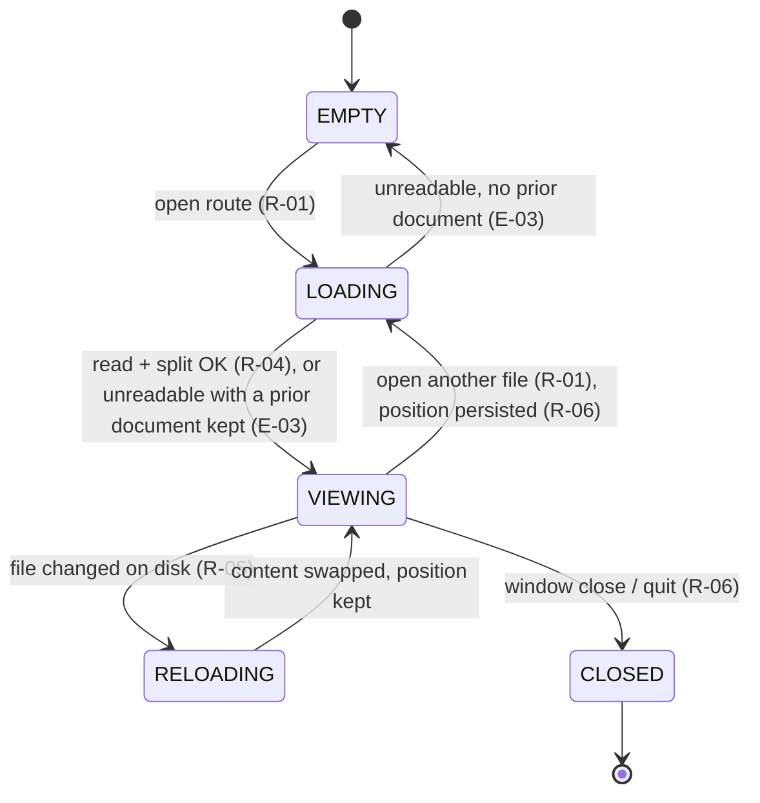
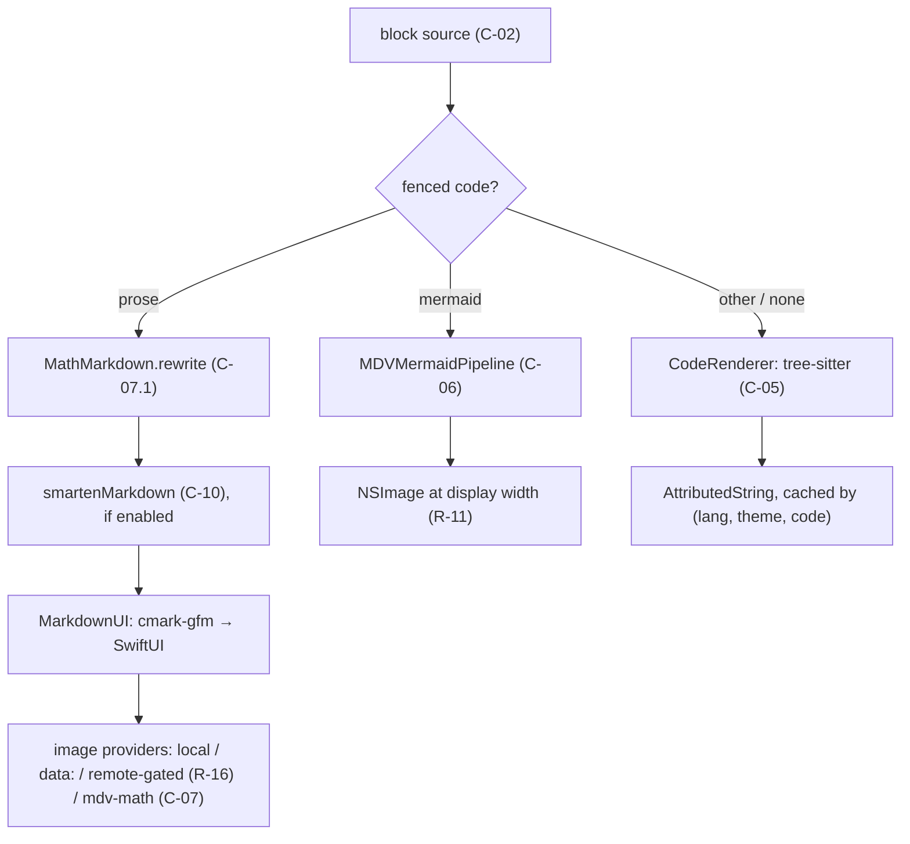

# SPECIFICATION — mdv (Markdown viewer, native macOS GUI + CLI launcher, Swift/SwiftUI)

> - **Status:** v0.2 — as-built specification of the system at commit `a6feb14` (branch `main`); v0.1 reviewed (`SPEC_REVIEW_REPORT.md`, findings F-001..F-031 applied)
> - **Language / stack:** Swift 5.9 (SwiftPM, no Xcode project) | SwiftUI + AppKit | MarkdownUI 2.4.1 (cmark-gfm) · SwiftTreeSitter 0.8 + nine vendored tree-sitter grammars · beautiful-mermaid-swift 1.0.4 (ELK layout) · SwiftMath 1.7.3 (vendored, patched) · SQLite (FTS5) | surfaces: macOS app bundle, `bin/mdv` shell launcher, `make` targets
> - **Sources:** `README.md`; `mdv/Help.md` (user-facing behaviour); `NOTES.md` (library gaps and their work-arounds); `TYPOGRAPHY.md` (theme conventions); `plans/CODEVIEW.md` (code-block design); `Vendor/SwiftMath/README.md`; the implementation in `mdv/*.swift`, `bin/mdv`, `build.sh`, `Makefile`, `Package.swift`, `.github/workflows/build.yml`; git history through `a6feb14`
> - **Scope of this document:** the observable behaviour of the mdv application and its launcher — file opening, rendering (Markdown, code, Mermaid, LaTeX), navigation, find and search, history, bookmarks, persistence, theming, packaging and release. It does **not** specify the internals of the third-party renderers beyond the contracts mdv relies on, nor the visual design values of individual themes (those live in `TYPOGRAPHY.md`).
> - **Normative language:** MUST/MUST NOT/SHALL/SHALL NOT = normative; SHOULD = strong recommendation; MAY = optional.
> - **Principle:** *Native and honest.* Every pixel is drawn by AppKit/SwiftUI/CoreText — no WebView, no JavaScript bridge — and when a renderer cannot handle an input, the user sees the source, never a blank.

---

## 0. Intent and purpose

mdv is a macOS application for *reading* Markdown. It renders a `.md` file the way a good document viewer renders a PDF: typographically deliberate, fast to open, with the navigation aids a long technical document needs (table of contents, in-document find, cross-file full-text search, bookmarks, back/forward history) and without any editing surface. It is meant to be the default handler for `.md` files on a developer's Mac, reachable from Finder, from the terminal (`mdv FILE`), and from other Markdown files via links.

The renderer is a pipeline of native components: cmark-gfm (via MarkdownUI) for Markdown, tree-sitter for code syntax highlighting, an ELK-based layout library for Mermaid diagrams, and a CoreText math typesetter for LaTeX. Each of those libraries has gaps relative to what real documents contain (Mermaid.js syntax, amssymb, `<br/>` in labels, …); mdv owns a **sanitising and repair layer** in front of each one so that documents written for GitHub or Mermaid.js render faithfully, and a **fallback rule** so that anything the layer cannot repair is shown as its source text with an explanation rather than dropped.

**Non-goals.** mdv does not edit Markdown (it hands off to an external editor); it does not render HTML blocks beyond what cmark-gfm passes through as text; it does not fetch remote images unless the user opts in; it does not sync anything off the machine; it is not sandboxed for the App Store (it reads arbitrary user files and installs a CLI symlink).

**Trust boundary.** Everything the application processes — file contents, link targets, image URLs, Mermaid and LaTeX source — is untrusted document content. The only network activity is the user-enabled remote-image fetch (R-16) and the release pipeline (§10). The application never executes document content.

## 1. Actors and goals

| Actor | Goals |
| ----- | ----- |
| **Reader** (human, GUI) | Open Markdown files by any route, read them with good typography, move around them quickly, find text within and across files, keep places, and get back to files read before. |
| **Terminal user** (human, `bin/mdv`) | Open one or more files, a directory, or stdin from a shell in the running application; query the version; install the launcher once. |
| **Finder / LaunchServices** (`com.mdv.app` document-type registration) | Route double-clicks, drag-onto-icon, and `open -a` of `.md`/`.markdown`/`net.daringfireball.markdown`/`public.plain-text` items into the application. |
| **External editor** (any macOS app the reader chooses) | Receive the current file on ⌘E; its saves are picked up by the live-reload watcher. |
| **Document author** (indirect) | Their GitHub-flavoured Markdown, Mermaid.js diagrams, and LaTeX math render as they would on GitHub / mermaid.live, or degrade visibly. |
| **Release engineer** (human, `make dist`, CI) | Produce a signed, notarised, stapled `.zip` from an exact `vX.Y.Z` tag; CI builds every push to `main` and publishes a rolling `latest` prerelease. |
| **Persistence store** (SQLite at `~/Library/Application Support/mdv/mdv.db`, `UserDefaults`) | Durably hold history, the full-text index, bookmarks, per-file scroll positions, and preferences across launches. |

## 2. Requirements (intent, high level)

Sources are cited as `[Help §…]`, `[README]`, `[NOTES]`, or a file path in `mdv/`.

### 2.1 Opening and loading

| ID | Statement |
| -- | --------- |
| **R-01** | The application MUST open a Markdown file from every one of: File → Open… (⌘O), Open in New Window… (⌘⇧O), a LaunchServices open event (Finder double-click, drag onto the icon, `open -a`), a file dropped onto the window, a Markdown link clicked inside a document (any local path, per R-19), a history-sidebar row, a search hit, and a bookmark. All routes MUST load the file into the active window's content view; only ⌘⇧O creates a window. `[Help §Opening files; mdv/mdvApp.swift application(_:open:)]` |
| **R-02** | When the opened path is a **directory**, the application MUST load `README.md` (case-insensitive match on the stem) if present, else the alphabetically-first file whose extension is `md`, `markdown`, or `mdown`, and MUST add every other such file in that directory to history as rows (not opened; primary first, the rest in alphabetical order) (R-20). `[Help §Opening files; ContentView.loadDirectory]` |
| **R-03** | A dropped item MUST be accepted only when its extension (case-insensitive) is one of `md`, `markdown`, `txt`, `mdown`, `mkd`; other drops MUST be ignored without error. `[ContentView.handleDrop]` |
| **R-04** | The file MUST be decoded as UTF-8; a file that is not valid UTF-8 is unreadable (E-03, D-16). The document MUST be split into **blocks** once per load (C-02) and every per-frame consumer (rendering, find, TOC, bookmarks) MUST read the cached split, never re-parse. `[ParsedDocument; commit 38df878]` |
| **R-05** | While a file is displayed, the application MUST watch it **by path** (not by open file descriptor or inode) and reload its content when the file changes on disk — a plain write, an atomic save that renames a temporary file over it, or a delete-and-recreate MUST all trigger a reload of the new content — coalescing bursts of change events within 50 ms into one reload. A reload MUST keep the reader's scroll position (clamped to the new block count) and MUST clear any block selection. If the file is deleted and not re-created, the window MUST keep its content, show no error, and keep the watch armed for the path (E-21). `[FileWatcher (FSEvents on the parent directory); Help §Editor integration]` |
| **R-06** | On load, the application MUST restore the reader's last scroll position for that path (C-08) when the stored anchor still resolves (E-08); otherwise it MUST start at the top. It MUST persist the current position on window close, on quit, and before loading a different file into the window. `[ContentView.persistScrollPosition]` |

### 2.2 Rendering

| ID | Statement |
| -- | --------- |
| **R-07** | Markdown MUST be rendered as GitHub-flavoured Markdown (cmark-gfm: tables, task lists, strikethrough, autolinks, footnotes) using the active theme's typography (R-29). `[README; ThemeManager.markdownTheme]` |
| **R-08** | Fenced code blocks MUST be syntax-highlighted with tree-sitter for the languages in K-05 (with the alias map in C-05), and MUST render as plain monospaced text — never an error — for any other or missing language hint. The block MUST show a language label, a hover-revealed toolbar (wrap toggle, copy), and a context menu; blocks in a shell language whose non-empty lines are at least half `$ `/`# `-prompted MUST additionally offer *Copy Without Prompts*, whose output is the block with the leading `$ ` or `# ` removed from each prompted line and **every other line copied unchanged** (output lines are kept; line count is preserved). `[CodeRenderer; CodeBlockChrome.copyWithoutPrompts]` |
| **R-09** | A ` ```mermaid ` fence MUST render as a diagram image drawn natively (C-06). The block MUST offer: a style menu (Document, Light, Dark, Tokyo Night, Catppuccin — the choice persisted document-wide in `mdv.mermaid.style`), *Show Mermaid source* (toggles to a monospaced source view — no Mermaid grammar exists, so it is not syntax-coloured), *Export diagram as PNG*, copy source, and pinch-to-zoom between $0.5\times$ and $4\times$. `[Help §Diagrams and math; MermaidCodeBlockChrome]` |
| **R-10** | Before parsing, Mermaid source MUST be sanitised per C-06.1 so that the Mermaid.js constructs listed there render; after layout, the corrections in C-06.2 MUST be applied. A diagram whose source the library cannot parse (e.g. `timeline`, `gantt`, `pie`, `mindmap`) MUST render the fallback: the text "Mermaid diagram could not be rendered" and the source in monospace. `[NOTES §Mermaid]` |
| **R-11** | A diagram MUST be rasterised at the exact width it is displayed at — its natural width, or the column width minus 36 pt if narrower, floored to whole points — at the backing scale of the screen the window is on (as built: `NSScreen.main`, the screen of the key window), and re-rasterised when that width, the committed zoom, or the backing scale changes (the raster cache key includes all three). It MUST NOT be drawn wider than its natural width. `[NOTES §Resolution; MDVMermaidDiagramView]` |
| **R-12** | LaTeX math delimited by `$…$` (inline) and `$$…$$` (display) MUST be typeset natively with SwiftMath in every block type — paragraphs, headings, list items, blockquotes, table cells — following the delimiter rules in C-07. Display math on its own paragraph MUST be centred and MUST offer *Copy LaTeX* in its context menu. `[Help §Diagrams and math; MathRenderer]` |
| **R-13** | Math inside an ATX heading MUST be sized by that heading's em factor (C-09); elsewhere by the body size times the zoom factor (R-30). Math colour MUST be the theme's text colour. `[MathMarkdown.rewrite]` |
| **R-14** | LaTeX that SwiftMath rejects MUST render as its source (`$…$` delimiters included) in monospace; a display block MUST additionally show the parser's message. Before typesetting, the command rewrites and symbol registrations of C-07.2 MUST be applied. `[MathImageCache.typeset; MathSymbols]` |
| **R-15** | A node label in a Mermaid flowchart or state diagram that is exactly one `$$…$$` span MUST be typeset with SwiftMath and composited centred in the node at the same pixel weight as document math (I-009). Math mixed with text, and math in edge labels, MUST be rendered as the Unicode approximation of C-07.3. `[NOTES §LaTeX in labels]` |
| **R-16** | Images MUST resolve `data:` URIs inline and relative paths against the document's directory. `http(s)` images MUST NOT be fetched unless View → *Load Remote Images* is on; when off, a clickable "Remote image blocked" placeholder MUST be shown instead. A missing local image MUST show an "image not found" placeholder naming the file. An image MUST NOT be scaled above its intrinsic size. `[LocalImageProvider; mdvApp View menu]` |
| **R-17** | When View → *Smart Typography* is on **and** the active theme allows it, prose blocks MUST be rendered with curly quotes, en/em dashes, and ellipses per C-10; fenced/inline code, GFM table blocks, thematic-break lines, link URLs, and `<…>` spans MUST be left verbatim. Math spans MUST be rewritten to image references *before* smartening so LaTeX is never altered. `[SmartTypography.swift; ContentView.blockView]` |

### 2.3 Navigation and selection

| ID | Statement |
| -- | --------- |
| **R-18** | The application MUST maintain per-window back/forward stacks whose entries are `(history entry, top block index)`. Loading a different file pushes the outgoing document's entry and clears the forward stack; ⌘← pops it, pushes the current view onto the forward stack, loads the file and scrolls to the saved block; ⌘→ is the mirror. A same-document fragment jump MUST push a snapshot so ⌘← returns to the previous position; re-opening the current path pushes nothing. `[Help §Moving around; NavSnapshot]` |
| **R-19** | Clicking a link MUST: navigate in-app when the target resolves to an existing local file with extension `md`/`markdown`/`mdown`; scroll to the **first** heading in document order whose GitHub-style slug (C-11) equals the fragment when the link is `#fragment` (only `#`–`###` single-line ATX headings are targets, C-02; an h4–h6 or setext heading is unreachable, E-22, D-17); and otherwise hand the URL to the system opener — deliberately including `file:` paths and custom schemes, as a browser would, since a click is an explicit user action. Relative targets MUST be resolved by path arithmetic against the document's directory. `[ContentView.handleLinkClick]` |
| **R-20** | The history sidebar MUST list every file opened, most recent first, capped at 100 entries, persisted across launches; a row MUST support swipe-to-delete. The sidebar MUST be collapsible (⌃⌘S, View menu, hover chevron) with the collapsed state persisted, and resizable by dragging its divider between 180 and 400 pt. `[HistoryManager; Help §Sidebars]` |
| **R-21** | The inspector MUST show a table of contents of the document's single-line ATX `#`, `##`, `###` headings (C-02), each row jumping to its block, with a search field that filters rows; and a collapsible bookmarks pane with a draggable height. The inspector's visibility and width (180–520 pt, dragged at its left edge) MUST persist. Heading text in the TOC MUST show math as Unicode (C-07.3), not as LaTeX source. `[Help §Sidebars; commit bcd2150]` |
| **R-22** | Reader text selection MUST work as in any text view, and additionally: a single click on a heading (mouse-up without movement, no modifier) MUST copy that heading's section (C-12) as Markdown to the pasteboard and flash the section for 0.6 s; a double-click MUST select the section (its first click performs the copy, its second the selection); a drag that starts on a heading MUST NOT copy; a drag across blocks MUST select whole blocks, expanding to include any section whose heading falls in the range; ⌘A MUST select every block; ⌘C MUST copy the selected blocks' source joined by blank lines; Esc MUST clear the selection. `[commits bae06a7, c50817a]` |
| **R-23** | ⌘E MUST open the current file in the chosen external editor; File → Edit → *Choose Editor…* picks one and *Forget Editor* clears it; with no editor set, ⌘E MUST prompt to choose. `[Help §Editor integration]` |

### 2.4 Find, search, bookmarks

| ID | Statement |
| -- | --------- |
| **R-24** | ⌘F MUST open an in-document find bar. Matching MUST be case-insensitive substring over each block's source; *m* counts **occurrences** (a block with three hits contributes three) in document order and the bar MUST show "*n* of *m*" (or "No matches"); ⌘G / ⇧⌘G MUST step per occurrence, wrapping at the ends, and scroll the match into view; Esc MUST close. Paragraph, heading, list, and blockquote blocks that contain no image MUST highlight the matched characters; every other block (code, table, and any block containing an image) MUST instead be tinted as a whole (E-17). When the sidebar (not the document) was last focused, ⌘F MUST route to the global search field. `[Help §Find; ContentView find]` |
| **R-25** | ⌘⇧F MUST focus a search field that queries the full-text index of every file in history (C-03): tokens are prefix-matched and ANDed; results (at most 80) MUST show the filename and a snippet with matched terms highlighted; choosing a result MUST open the file. `[Help §Find; Database.search]` |
| **R-26** | The application MUST index a file's content into the full-text index when it is opened and re-index history on launch, skipping any file whose modification time is unchanged since its last indexing. Removing a file from history (swipe-delete, clear) MUST remove its row from the index, so the search population is exactly the current history. `[Database.indexFile/removeFile; HistoryManager.remove]` |
| **R-27** | ⌘D MUST add a bookmark at the block under the pointer if one is hovered, else at the topmost block whose frame intersects the viewport; titled by the nearest preceding ATX heading within the previous 40 blocks, else the block's own first 40 characters of source, else `(empty)`; anchored by block index *and* fingerprint (C-08). Bookmarking the same block twice creates two rows. Bookmarks MUST persist in order; the first five MUST be bound to ⌘1…⌘5 (Bookmarks menu shows their titles); rows MUST be reorderable by drag and removable. Opening a bookmark MUST load its file if needed and scroll to the resolved anchor (E-08). `[Help §Bookmarks; BookmarksManager]` |
| **R-28** | ⌘⇧0 MUST set a transient in-memory placeholder at the current spot and ⌘0 MUST return to it; the placeholder MUST NOT survive relaunch. `[Help §Bookmarks]` |

### 2.5 Appearance and preferences

| ID | Statement |
| -- | --------- |
| **R-29** | The reader MUST be able to choose one of the nine named themes or *System* from the toolbar; *System* MUST resolve to `high-contrast` in Light appearance and `twilight` in Dark and MUST switch live when macOS appearance changes. Each theme MUST restyle the article pane, code palette, and the diagram *Document* style; the choice MUST persist (`mdv_theme_id`). `[ThemeManager; TYPOGRAPHY.md]` |
| **R-30** | ⌘= / ⌘- MUST scale body text by $\pm 0.10$ per step, clamped to $[0.60, 2.50]$; View → Actual Size MUST reset to $1.0$; the factor MUST persist (`mdv_font_scale`) and MUST also scale document math (R-13). A zoom HUD MUST show $\lfloor 100 \cdot \mathrm{scale} + 0.5 \rfloor$ % for 0.9 s after each change (K-06). `[ThemeManager fontScale]` |
| **R-31** | ⌘? (Help → mdv Help) MUST open the bundled `Help.md`, copied on demand to `~/Library/Application Support/mdv/Help.md` so it has a stable path for history and bookmarks. `[HelpManager]` |
| **R-32** | Every preference in C-04 MUST persist via `UserDefaults` under the listed key and MUST be honoured on the next launch. |

### 2.6 Launcher, packaging, diagnostics

| ID | Statement |
| -- | --------- |
| **R-33** | `bin/mdv` MUST implement the surface in §5.2: locate the app bundle per the documented search order, open files/directories by absolute path, read stdin into a temporary `.md` for `-`, print the bundle version for `--version`, and exit `1` with `mdv: no such file: <path>` on stderr for a missing argument. `[bin/mdv]` |
| **R-34** | `make` (default) MUST build a runnable `build/mdv.app` from a clean checkout with only the Swift toolchain, copying every resource the app needs (C-13); `make install` MUST place it in `/Applications`, register it with LaunchServices, and symlink the CLI; `make dist` MUST refuse to run unless `HEAD` carries an exact `vX.Y.Z` tag. `[Makefile; build.sh]` |
| **R-35** | The application MUST NOT print document content, file contents, or query strings to any log at any verbosity. The only diagnostics it emits are `NSLog` lines on persistence-store failures (E-12) and the font-registration lines SwiftMath prints once per font on first use. |
| **R-36** | The application MUST NOT crash on any document: a repair layer failure MUST degrade to the fallback of R-10/R-14, and every path that reaches a third-party parser MUST be preceded by the sanitisation that keeps that parser inside its asserted invariants (E-01). `[NOTES §Mermaid: ELK layout asserts]` |
| **R-37** | The repository MUST carry an automated test suite runnable with `swift test` from a clean checkout, covering at least the pure contracts (C-02 block split, C-03 query construction, C-07.1 delimiters and C-07.3 plain text, C-08 fingerprint/resolve, C-10 smart typography, C-11 slugs, C-12 sections) and the Mermaid/LaTeX sanitisers (C-06.1, C-07.2), and CI MUST run it on every push to `main` and on every pull request. *Not yet built* — see D-01 and §9.0. |
| **R-38** | Fenced code blocks tagged `swift` and `sql` MUST be syntax-highlighted with tree-sitter like the languages of K-05: the `tree-sitter-swift` and `tree-sitter-sql` grammars (parser, scanner, and a `highlights.scm`) vendored under `mdv/Grammars/`, pinned in its README, compiled into `CGrammars`, and resolved from the fence hints in C-05 (`swift`; `sql`, `sqlite`, `postgresql`/`postgres`, `mysql`, `plsql`, `tsql`). Highlighting quality MUST match the existing languages: keywords, strings, comments, numbers, types, and function names each map to a palette capture. *Not yet built* — see D-15. |
| **R-39** | The repository MUST contain the render harness (`tools/render-harness/`: a SwiftPM executable that links the app's pipeline code and renders a Markdown or Mermaid file to PNG, with `--scan` and `--check` modes) and a Mermaid corpus (`test-docs/mermaid/*.mmd`, one diagram per file, licences cleared) so that T-13, T-17 and T-19 are reproducible from a clean checkout. *Not yet checked in* — see D-01. |
## 3. Behavior and state model

### 3.1 Document lifecycle

A window holds at most one **current document**. Its states and transitions:

| State | Meaning | Enters via | Leaves via |
| ----- | ------- | ---------- | ---------- |
| `EMPTY` | No file loaded; the drop target / Open… prompt is shown. | launch with no file; history cleared | any open route (R-01) → `LOADING` |
| `LOADING` | Outgoing document's scroll position persisted (R-06); file read from disk, split into blocks (C-02), history row added (R-20), file indexed (R-26), scroll anchor looked up (R-06). | open route | success → `VIEWING`; unreadable file → the **previous state** (`VIEWING` of the prior document, or `EMPTY` if there was none), no history change (E-03) |
| `VIEWING` | Blocks rendered lazily; watcher armed on the path (R-05); find/TOC/bookmarks operate on the cached split. In-flight renders (diagram layout, math) are cancelled when the document changes. | `LOADING` | open of another file → `LOADING`; file changed on disk → `RELOADING`; file deleted → stays `VIEWING` (E-21); window close → `CLOSED` |
| `RELOADING` | New content replaces `rawMarkdown` in place; scroll position kept; selection cleared. | watcher event, coalesced 50 ms | → `VIEWING` |
| `CLOSED` | Scroll position persisted (R-06); watcher cancelled. | window close, quit | terminal |



*Figure 3.1 — document lifecycle per R-01, R-04..R-06, E-03, E-21. The table is normative; the diagram is illustrative.*

### 3.2 Render pipeline for one block

Every visible block goes through the same path on each render (the split itself happens once per load, R-04):



*Figure 3.2 — per-block render path per R-07..R-17. Each edge corresponds to a §4 contract; the diagram is illustrative.*

Order matters in one place and is normative: **math rewriting precedes smart typography** (R-17), so that `--`, `...`, and quotes inside `$…$` are never curled or dashed.

### 3.3 Durable artifacts

| Artifact | Location | Written when | Read when |
| -------- | -------- | ------------ | --------- |
| History list | `UserDefaults["mdv_history"]` (JSON per C-15, $\leq 100$ entries) | every open, delete, clear | launch |
| Full-text index | `mdv.db` tables `articles`, `articles_fts` (C-03) | every open (mtime-gated), launch re-index | ⌘⇧F search |
| Bookmarks | `mdv.db` table `bookmarks` (C-08) | ⌘D, reorder, remove | launch, Bookmarks menu, inspector |
| Scroll positions | `mdv.db` table `scroll_positions` (C-08) | window close / quit / file switch (R-06) | file load |
| Preferences | `UserDefaults` keys in C-04 | on change | launch |
| Help file | `~/Library/Application Support/mdv/Help.md` | first ⌘? per launch (copied from the bundle) | ⌘? |
| Render caches | in-memory only: code `AttributedString` (256 entries), math images (2048), Mermaid layouts (96) and rasters (192, ≤ 192 MB) | render | render |

`mdv.db` MUST be opened with `SQLITE_OPEN_FULLMUTEX`, `journal_mode = WAL`, `synchronous = NORMAL` (I-006). Its `meta` table holds `schema_version` (currently `4`); `migrate()` MUST apply forward migrations by comparing it and bump it in the same transaction.

## 4. Interfaces / contracts

### C-01 Application bundle and document types

```
mdv.app/
  Contents/Info.plist        CFBundleIdentifier com.mdv.app, LSMinimumSystemVersion 13.0,
                             CFBundleShortVersionString 1.0.0
                             CFBundleDocumentTypes: extensions [md, markdown];
                             LSItemContentTypes [net.daringfireball.markdown, public.plain-text]
  Contents/MacOS/mdv         SwiftPM executable
  Contents/Resources/        AppIcon.icns · *.otf (Alegreya, Besley, OpenDyslexic) ·
                             *-highlights.scm (9) · mathFonts.bundle/ (Latin Modern Math + plist)
                             · mdv (CLI script, for "Install Command Line Tool…") · Help.md
Entitlements: app-sandbox = false; files.user-selected.read-only = true
```

### C-02 Document split: `ParsedDocument`

```swift
struct ParsedDocument {            // computed once per load (R-04); equality on `raw`
    let raw: String
    let blocks: [String]           // see rules
    let tocHeadings: [TOCHeading]  // level 1…3, single-line ATX only
}
struct TOCHeading { level: Int; text: String /*display*/; slugText: String /*for #fragment*/; blockIndex: Int }
```

Split rules (normative):

1. Input is split on `\n`. A **blank line** (only whitespace) ends the current block.
2. A line whose first non-space characters are ` ``` ` or `~~~` opens a **fence**; blank lines inside a fence do not split; the fence closes at the next line starting (after spaces) with the same three-character marker — *as built, the closing run is not required to be at least as long as the opener* (a deviation from CommonMark; see E-23). An unclosed fence runs to the end of the input.
3. A line whose first non-space characters are `$$`, with no second `$$` on the same line, opens a **math fence**; it closes at the next line *containing* `$$`, or at the end of the input.
4. Indented code blocks (four spaces) are **not** recognised by the splitter: a blank line inside one splits it into two blocks (E-23).
5. Leading/trailing newlines of a block are trimmed; empty blocks are dropped.
6. Lines are split on `\n`; a trailing `\r` (CRLF input) is whitespace for the blank-line test and is otherwise passed through to the renderer.
7. `tocHeadings` contains each block whose trimmed text starts with `# `, `## `, or `### ` and is not a fence, using its first line only. `text` is the line with inline Markdown stripped (C-12 rules) and math converted per C-07.3; `slugText` is the same without the math conversion.

### C-03 Full-text index

```sql
CREATE TABLE articles (id INTEGER PRIMARY KEY, path TEXT NOT NULL UNIQUE, filename TEXT NOT NULL,
    content TEXT NOT NULL DEFAULT '', indexed_at INTEGER NOT NULL,
    file_mtime INTEGER NOT NULL DEFAULT 0, file_size INTEGER NOT NULL DEFAULT 0);
CREATE VIRTUAL TABLE articles_fts USING fts5(filename, content, path UNINDEXED,
    content='articles', content_rowid='id', tokenize='unicode61 remove_diacritics 2');
-- triggers keep articles_fts in step with INSERT/UPDATE/DELETE on articles
```

Query construction: split the input on whitespace; drop the characters `" ( ) : * ^` from each token; wrap each remaining token as `"token"*`; join with spaces (FTS5 implicit AND). A query with no surviving tokens performs no search and yields no results. Results: `ORDER BY rank LIMIT 80`, with `snippet(articles_fts, 1, char(2), char(3), '…', 14)` — U+0002/U+0003 bracket matched terms and the UI renders them highlighted.

### C-04 Preferences (`UserDefaults`)

| Key | Type | Default | Meaning |
| --- | ---- | ------- | ------- |
| `mdv_theme_id` | String | `high-contrast` | Theme id or `system` (R-29) |
| `mdv_font_scale` | Double | `1.0` | Zoom factor (R-30), clamped on read |
| `mdv_smart_typography` | Bool | `true` | View → Smart Typography (R-17) |
| `mdv_load_remote_images` | Bool | `false` | View → Load Remote Images (R-16) |
| `mdv_sidebar_collapsed` | Bool | `false` | History sidebar hidden (R-20) |
| `mdv_inspector_visible` | Bool | `false` | TOC/bookmarks inspector shown (R-21) |
| `mdv_inspector_width` | Double | `240` | Inspector width, clamped to $[180, 520]$ |
| `mdv_bookmarks_expanded` | Bool | `false` | Bookmarks pane open |
| `mdv_bookmarks_height` | Double | `240` | Bookmarks pane height, clamped at use (K-04) |
| `mdv_editor_app_path` | String | `""` | External editor bundle path (R-23) |
| `mdv_history` | Data (JSON) | `[]` | History entries (R-20, C-15) |
| `mdv.mermaid.style` | String | `document` | Diagram style (R-09) |

### C-05 Code highlighting: `CodeRenderer`

```swift
func render(code: String, languageHint: String?, theme: MDVTheme) -> AttributedString   // synchronous, never throws
```

- Language resolution: lower-case the info string, keep its first word; direct names `c go rust bash javascript yaml toml python ruby` (+ `swift sql` once R-38 lands); aliases `js jsx javascriptreact node → javascript`, `sh zsh shell → bash`, `py python3 → python`, `rb → ruby`, `yml → yaml`, `rs → rust`, `golang → go`, `h objective-c objc → c` (+ `sqlite postgresql postgres mysql plsql tsql → sql` per R-38); anything else → plain.
- Highlighting: parse with a fresh `Parser` per call, run the grammar's `highlights.scm`, colour each capture from the theme's `CodePalette` by capture-name components; `comment` captures are italic. If the query fails to compile, that language falls back to plain for the rest of the session.
- Result cache: key `(language, theme id, hash(code))`, at most 256 entries.

### C-06 Mermaid pipeline: `MDVMermaidPipeline`

```swift
static func prepare(source: String, theme: DiagramTheme) throws -> MDVMermaidPrepared  // parse → repair → layout (ELK)
static func rasterize(_ p: MDVMermaidPrepared, width: CGFloat, scale: CGFloat) -> NSImage?  // CoreText at final size, upright
static func displaySize(for p: MDVMermaidPrepared, width: CGFloat) -> CGSize  // whole points; shared by view and raster
```

**C-06.1 Source sanitisation (before parsing), in this order:**

| # | Rule | Reason |
| - | ---- | ------ |
| 1 | Drop a leading YAML front-matter block (`---` … `---`). | parser rejects it (`invalidHeader`) |
| 2 | xychart: `line "name" [...]`/`bar "name" [...]` → `line [...]`/`bar [...]`. | parser knows only the unnamed form |
| 3 | On `style`/`classDef`/`linkStyle` lines: expand `#rgb`/`#rgba` to 6/8 digits; map these CSS colour names (case-insensitive) to hex: `white black red green blue yellow orange purple gray grey lightgray lightgrey darkgray silver pink lightblue lightgreen lightyellow gold teal navy maroon olive cyan magenta brown beige ivory lavender coral salmon tomato crimson indigo violet khaki tan wheat mintcream honeydew aliceblue whitesmoke gainsboro snow`, plus `transparent` and `none` → `#00000000`. Any other name is passed through (and renders black). | 3-digit hex and names render **black** |
| 4 | stateDiagram: fold every `ID: text` description line for an ID into one `state "a<br/>b" as ID` alias inserted after the header. | parser keeps only the first registration |
| 5 | `id[/text/]` and `id[\text\]` (parallelograms) → `id[text]`. | not in the parser's shape table |
| 6 | Strip inline formatting tags `<b> <i> <u> <s> <strong> <em> <small> <sup> <sub> <span> <code> <tt> <font> <mark>` (open and close), keeping their content; leave `<br/>`. | rendered literally |

**C-06.2 Post-parse and post-layout repairs:**

| Diagram | Repair |
| ------- | ------ |
| flowchart, stateDiagram | Subgraph ownership: a node listed in several subgraphs belongs to the **last** one (Mermaid.js semantics); it is removed from the others. (Prevents the ELK `assert`, E-01.) |
| stateDiagram | `classDef`, `class A,B name`, and `style` lines read from the source are applied to the model (`classDefs`, `classAssignments`, `nodeStyles`). |
| flowchart, stateDiagram | Whole-label `$$…$$` nodes: label replaced by a blank placeholder measured to the math image's size; image composited after rasterising, centred, at a pixel-snapped origin (R-15, I-009). |
| sequenceDiagram | `<br>` → newline in notes; → space in actor labels; message labels with `<br>` are blanked and drawn by mdv, lines stacked upward from the arrow (13 pt pitch, 11 pt font, muted colour). |
| sequenceDiagram | Actor gaps widened until every message label fits between its endpoints (+ 24 pt; self-messages + 36 pt); all x coordinates remapped piecewise-linearly through old→new actor centres. |
| sequenceDiagram | Multi-line message rows: the message and everything below shifted down $(n-1) \times 13 + 4$ pt; spanning blocks, lifelines, and the diagram height grow. |
| sequenceDiagram | A block whose last item is a note is extended to enclose it (+ 8 pt). `autonumber` draws a filled disc ($r = 8$ pt) with the 1-based index at each arrow's tail. |

**C-06.3 Document theme.** The *Document* style derives a `DiagramTheme` from the active `MDVTheme`: background = code-block background, foreground = text colour, node surface = page colour mixed 25 % toward the code background on light themes (lifted 16 % toward foreground on dark), lines/borders/muted = fixed mixes of background and foreground.

### C-07 LaTeX math

**C-07.1 Rewriting.** `MathMarkdown.rewrite(block, fontSize, headingSizeEms, color)` replaces each math span in a prose block with an image reference

```
>?s=<size pt, 1 decimal>&c=<RRGGBBAA>)     // $…$, or $$…$$ mid-line
>?s=…&c=…)                                // $$…$$
```

A `$$…$$` whose opening is at line start and closing at line end is emitted as its **own paragraph** (blank lines inserted, indentation preserved) so MarkdownUI's block-image path renders it centred via `MathDisplayView`; every other span is an inline image via `MathInlineImageProvider`. `base64url` is RFC 4648 §5 without `=` padding; decoders MUST re-pad to a multiple of four. Delimiter rules (Pandoc `tex_math_dollars`): an opening `$` is followed by non-whitespace; a closing `$` is preceded by non-whitespace and not followed by a digit; a span contains no bare `$` and never crosses a backtick; `\$` is literal; fenced blocks and inline code are never rewritten; an empty `$$` pair is literal.

**C-07.2 Typesetting.** `MathImageCache.rendered(for: MathSpec)` typesets with `MathImage(latex, fontSize, textColor, labelMode: display ? .display : .text)` after (a) registering the extra symbols and (b) applying the rewrites below, and bakes the result to a bitmap at the screen scale (I-008). Cache: 2048 entries keyed by the URL.

| (a) Registered symbols (Latin Modern Math has the glyphs) | (b) Command rewrites (regex, in order) |
| --- | --- |
| relations: `gtrsim lesssim gtrapprox lessapprox leqslant geqslant lll ggg nless ngtr nleq ngeq doteq triangleq therefore because implies impliedby models vDash Vdash nparallel nmid subsetneq supsetneq nsubseteq nsupseteq sqsubseteq sqsupseteq precsim succsim`; arrows: `hookrightarrow hookleftarrow rightharpoonup leftharpoonup rightleftharpoons leftrightharpoons nearrow searrow swarrow nwarrow longmapsto twoheadrightarrow rightsquigarrow leadsto rightrightarrows leftleftarrows`; ordinary: `dots dotsc dotsb varnothing hslash mho Box square blacksquare bigstar checkmark ddagger S P pounds copyright degree beth gimel wp nexists complement # _`; big operators: `iint iiint oiint bigsqcup bigodot bigotimes biguplus`; binary: `intercal leftthreetimes rightthreetimes divideontimes` | `\operatorname*{X}` → `\mathrm{X}`; `\dfrac`/`\tfrac` → `\frac`; `\boldsymbol` → `\bm`; `\bmod` → `\;\mathrm{mod}\;`; `\pmod{n}` → `\;(\mathrm{mod}\;n)`; `\not=` → `\neq`; `\big \Big \bigg \Bigg` (with optional `l r m`) before a delimiter → removed; `\coloneqq` → `:=`; `align*`/`equation*`/`gather*`/`multline*` → unstarred; `align` → `aligned`; `multline` → `gather`; `\begin{equation}`/`\end{equation}` → removed |

`\boxed{…}` is implemented in the vendored SwiftMath (`MTBoxed` atom, `MTBoxDisplay`: frame of fraction-rule thickness with $0.35\,\mathrm{em}$ padding). Unsupported and shown as source: `\underbrace`, `\overbrace`, `\stackrel`, `\substack`, `\&`.

**C-07.3 Plain-text form** (`MathMarkdown.plainText`), used by the TOC, bookmark titles, and mixed Mermaid labels: same delimiter rules; `\frac{a}{b}` → `a/b`, `\sqrt{x}` → `√x`, wrappers (`\text \mathrm \mathbf \mathit \mathcal \mathbb \operatorname \boldsymbol \bm \hat \vec \bar \tilde`) → their content; `^`/`_` followed by a character or `{…}` → Unicode super/subscript when every character has one (digits, `+ - n i` / `+ - i j n k x`), else kept verbatim; Greek letters, common relations/operators/arrows/sets → Unicode; unknown commands → their name; braces removed; whitespace collapsed.

### C-08 Anchors: bookmarks and scroll positions

```sql
CREATE TABLE bookmarks (id INTEGER PRIMARY KEY, path TEXT NOT NULL, title TEXT NOT NULL,
    sort_order INTEGER NOT NULL, created_at INTEGER NOT NULL,
    block_index INTEGER NOT NULL DEFAULT 0, block_fingerprint TEXT NOT NULL DEFAULT '');
CREATE TABLE scroll_positions (path TEXT PRIMARY KEY, block_index INTEGER NOT NULL,
    block_fingerprint TEXT NOT NULL, updated_at INTEGER NOT NULL, file_mtime INTEGER NOT NULL DEFAULT 0);
```

`fingerprint(block)` = the block's words joined by single spaces, lower-cased, truncated to 80 characters. `resolve(blocks, storedIndex, fingerprint)` = the first block whose fingerprint equals the stored one; else `storedIndex` clamped to $[0, |\mathrm{blocks}|-1]$; else 0 for an empty document. A scroll position is restored only when the stored anchor resolves **and** the file's modification time is within 1 s of the stored `file_mtime` **and** the index is in bounds (E-08).

### C-09 Theme contract (`MDVTheme`), the fields behaviour depends on

```swift
struct MDVTheme {
    let id: String; let isDark: Bool
    let text, secondaryText, tertiaryText, heading, strong, link, accent, background, secondaryBackground, border, divider, blockquoteBar: Color
    var bodyFontFamily: FontFamily; var baseFontSize: CGFloat            // default 16
    var h1SizeEm = 1.75, h2SizeEm = 1.4, h3SizeEm = 1.15; h4SizeEm 1.0, h5SizeEm 0.875, h6SizeEm 0.85 (fixed)
    var headingSizeEms: [CGFloat]     // [h1…h6], used by markdownTheme and by math in headings (R-13)
    var articleMaxWidth: CGFloat?; var articleHorizontalPadding: CGFloat
    var smartTypographyAllowed: Bool  // false for phosphor, standard-erin-light, standard-erin-dark
    var codePalette: CodePalette?     // default: oneDark (dark) / githubLight (light)
}
static let all = [highContrast, sevilla, charcoal, solariumDaylight, solariumMoonlight, phosphor, twilight, standardErinLight, standardErinDark]
```

Code blocks always use the system monospace face regardless of `bodyFontFamily` (`TYPOGRAPHY.md`).

### C-10 Smart typography (`smartenMarkdown`)

Applied to one block; the block is returned unchanged if it is a fence, looks like a GFM table (a `|---|` separator row), or is a thematic-break line. Otherwise, outside inline code spans (a run of *n* backticks closes only on a run of exactly *n*), link/image URL parts (`](` … matching `)`), and `<…>` spans: `"` and `'` → directional quotes chosen from the preceding character; `---` → `—`; `--` between letters/digits → `–`; ` -- ` → ` — `; other `--` runs unchanged (CLI flags survive); `...` → `…`.

### C-11 Heading slug

`slug(s)` = lower-case `s`; keep letters and digits; keep `-` and `_` when something precedes them; collapse runs of whitespace into one `-`; strip trailing `-`/`_`. Applied to both the link fragment and `TOCHeading.slugText`; equality selects the target, and when several headings share a slug the **first in document order** wins. GitHub's numeric disambiguation suffixes (`-1`, `-2`) are not generated (D-17).

### C-12 Section and inline-stripped text

`section(headingAt i)` = blocks $[i, j)$ where $j$ is the index of the next heading with level $\leq$ the level of $i$, or the block count. Copy output = those blocks joined with `\n\n`. `stripInlineMarkdown` removes trailing `#`s, `**`, `__`, backticks, unescaped `*`, word-internal `_…_` markers, and reduces `[text](url)` to `text`.

### C-15 History persistence (`mdv_history`)

```json
[ { "id": "<UUID>", "path": "/abs/path/to/file.md", "addedAt": <seconds since 2001-01-01 as Double> }, … ]
```

Swift `Codable` encoding of `[HistoryEntry]` (`id: UUID`, `path: String`, `addedAt: Date`, keys as shown, default `JSONEncoder` date strategy). Order is most recent first. `filename` is derived (last path component), not stored. A value that fails to decode MUST yield an empty history, never a crash; unknown keys MUST be ignored.

### C-13 Build outputs (`build.sh`)

```
swift build -c {debug|release}
build/mdv.app/Contents/{MacOS/mdv, Info.plist, Resources/{AppIcon.icns, *.otf, *-highlights.scm,
                        mathFonts.bundle/, mdv, Help.md}}
codesign --force --sign - --entitlements mdv/mdv.entitlements build/mdv.app     # ad hoc
```

The vendored SwiftMath resolves `mathFonts.bundle` from `Bundle.main` first and from `Vendor/SwiftMath/mathFonts.bundle` (by `#filePath`) when running unbundled (`swift run`).

## 5. Interface specification

### 5.1 GUI: menus and shortcuts

| Menu · item | Shortcut | Effect | Errors / disabled |
| ----------- | -------- | ------ | ----------------- |
| mdv · Install Command Line Tool… | — | Symlink `/usr/local/bin/mdv` → `Contents/Resources/mdv` (asks for admin rights) | failure: system beep, symlink untouched |
| File · Open… | ⌘O | Open panel; loads into this window (R-01) | cancel: no-op |
| File · Open in New Window… | ⌘⇧O | Open panel; new window | — |
| File · Edit · Edit Current File | ⌘E | Open current file in the chosen editor (R-23) | no editor: prompts to choose |
| File · Edit · Choose Editor… / Forget Editor | — | Set / clear `mdv_editor_app_path` | — |
| Edit · Find… | ⌘F | Find bar, or global search when the sidebar was last focused (R-24) | — |
| Edit · Search History… | ⌘⇧F | Focus global search (R-25) | — |
| Edit · Copy / Select All | ⌘C / ⌘A | Block selection (R-22) when the document is active; text field otherwise | — |
| Navigate · Back / Forward | ⌘← / ⌘→ | History stacks (R-18) | disabled when empty |
| View · Show/Hide Sidebar | ⌃⌘S | Toggle history sidebar (R-20) | — |
| View · Zoom In / Zoom Out / Actual Size | ⌘= / ⌘- / — | R-30 | Actual Size disabled at 1.0 |
| View · Smart Typography | — | Toggle R-17; label reads "(off for this theme)" and is disabled when the theme opts out | — |
| View · Load Remote Images | — | Toggle R-16 | — |
| Bookmarks · Bookmark Current Spot | ⌘D | R-27 | — |
| Bookmarks · Set Placeholder / Jump to Placeholder | ⌘⇧0 / ⌘0 | R-28 | Jump disabled when none |
| Bookmarks · slot 1…5 | ⌘1…⌘5 | Open bookmark *n* (R-27) | disabled when the slot is empty |
| Help · mdv Help | ⌘? | R-31 | — |
| Find bar | ⌘G / ⇧⌘G / Esc | next / previous / close (R-24) | stepping disabled with no matches |
| Document | Esc | Clear block selection (R-22) | — |
| Toolbar | — | Theme picker (nine themes + System), inspector toggle, Open, Edit | — |

In-block controls: code blocks — hover toolbar (wrap, copy), context menu (Copy Code, Wrap Long Lines, Copy Without Prompts when applicable); Mermaid blocks — hover capsule (style menu, show source, export PNG, copy) and context menu (Copy Code, Show Mermaid Source / Show Diagram, Diagram Style, Export Diagram as PNG); display math — context menu (Copy LaTeX). PNG export writes the diagram at natural size, $2\times$ pixel density, to a user-chosen path; failure beeps.

### 5.2 CLI: `bin/mdv`

| Invocation | Behaviour | Exit |
| ---------- | --------- | ---- |
| `mdv` | `open <app>` | 0 |
| `mdv FILE…` / `mdv DIR` | Each argument resolved to an absolute path; `open -a <app> <paths…>` (the app receives them via LaunchServices, R-01/R-02) | 0; `1` + `mdv: no such file: <arg>` on stderr if any argument does not exist (nothing opened) |
| `mdv -` | stdin copied to `$(mktemp -t mdv-stdin).md`, then opened | 0 |
| `mdv -h` / `--help` | Usage text (lines 2–9 of the script) to stdout | 0 |
| `mdv --version` | `CFBundleShortVersionString` from the located bundle's `Info.plist` | 0 |
| any, bundle not found | `mdv: mdv.app not found (set MDV_APP or install to /Applications)` on stderr | 1 |

Bundle search order: `$MDV_APP` (if a directory) → `/Applications/mdv.app` → `~/Applications/mdv.app` → `../build/mdv.app` and `../mdv.app` relative to the script → `mdfind "kMDItemCFBundleIdentifier == 'com.mdv.app'"` (first hit).

### 5.3 Build and release: `make`

| Target | Effect |
| ------ | ------ |
| `make` / `build` | `deps` check (Swift $\geq$ 5.9, macOS $\geq$ 13, `build.sh` executable) then `./build.sh debug` → `build/mdv.app` (C-13) |
| `release` | `./build.sh release` |
| `run` | build + launch |
| `install` | copy to `/Applications/mdv.app`, `lsregister -f`, then `install-cli` (sudo symlink `/usr/local/bin/mdv` → `bin/mdv`) |
| `uninstall` | remove the symlink and `/Applications/mdv.app` |
| `register` | `lsregister -f build/mdv.app` |
| `clean` | remove `build/` and `.build/` |
| `dist` | `check-version` (exact `vX.Y.Z` tag, else exit 1; `VERSION=x.y.z` on the command line overrides the tag lookup for one-off testing and is not a release path, R-34) → `clean` → `release` → `sign` (Developer ID, hardened runtime, timestamp; `codesign --verify --deep --strict`) → `zip-notary` → `notarize` (keychain profile) → `staple` → `zip-release` → `checksum` (`.sha256`) → `verify-release` (`spctl`) |
| `github-release` | upload the zip and checksum to the GitHub release for the tag |
| `icon` | regenerate `mdv/AppIcon.icns` from `MDV.png` |

CI (`.github/workflows/build.yml`): on every push to `main`, build `debug` and `release` on `macos-15`, verify the bundle layout, upload `mdv-release.tar.gz`, and publish it as the rolling `latest` prerelease.

### 5.4 Cross-cutting: diagnostics and failure reporting

| ID | Contract |
| -- | -------- |
| **R-35** (above) | Nothing document-derived is logged. |
| **C-14** | User-visible failures are reported in place, never modally: unrenderable diagram / math → fallback text in the block (R-10, R-14); missing or blocked image → placeholder in the block (R-16); PNG export or CLI-install failure → system beep; missing bookmark file → row marked as missing in the inspector (E-09); unreadable file → the window stays on its previous content (E-03). |

## 6. Invariants (must hold in every valid implementation)

| ID | Invariant |
| -- | --------- |
| **I-001** | Rendering is pure in its inputs: the same file bytes, theme, zoom, preferences, window content width, and backing scale produce the same blocks, TOC, and rendered output; no render path reads the network except the remote-image fetch gated by R-16. |
| **I-002** | The application MUST NOT terminate because of document content. Every third-party parser is reached only through its sanitiser (C-06.1, C-07.1/2), and every parse/layout failure becomes a fallback block. |
| **I-003** | Document content never reaches a log, an external URL or network request, or a subprocess (the in-process `mdv-math://` image scheme of C-07.1 is not external). The only externally visible artefacts derived from a document are the user's pasteboard (on explicit copy), a user-chosen PNG (on export), and `mdv.db`. |
| **I-004** | The block split (C-02) is computed at most once per distinct `raw` string per load; `blocks[i]` is stable for the life of the document, so block indices used by find, TOC, selection, bookmarks, and scroll anchors refer to the same text. |
| **I-005** | Every mermaid raster is displayed at exactly its own point size — `displaySize(for:width:)` is the single source of both the bitmap size and the view frame — so the diagram is never resampled by the view layer. |
| **I-006** | All access to `mdv.db` goes through one connection opened `FULLMUTEX`, in WAL mode; concurrent use from the history re-index queue and the main thread is serialised by SQLite, never by the caller. |
| **I-007** | Persistence writes are whole-row `INSERT … ON CONFLICT DO UPDATE` or single-statement updates; a crash mid-write leaves the previous row, never a partial one. |
| **I-008** | Every `NSImage` handed to SwiftUI `Text`/`Image` for math is bitmap-backed (not drawing-handler-backed); idle CPU with math on screen is that of a static page. |
| **I-009** | Math drawn inside a Mermaid raster is drawn at a pixel-aligned origin; its ink weight, per the formula in §7.1, is at least $0.9\times$ that of the same expression typeset for the document at the same size and scale. |
| **I-010** | Heading slugs (C-11) are computed from the un-mathed heading text, so `#fragment` links written for GitHub resolve identically whether or not the heading contains `$…$`. |
| **I-011** | The vendored SwiftMath carries exactly the patches listed in `Vendor/SwiftMath/README.md`; everything else is byte-identical to upstream v1.7.3. |
| **I-012** | Smart typography never changes bytes inside code spans, fences, link URLs, `<…>` spans, GFM tables, thematic breaks, or math. |
| **I-013** | The history list never exceeds 100 entries and never contains duplicates; the most recently opened path is first. |

## 7. Constraints (precise and measurable)

| ID | Constraint |
| -- | ---------- |
| **K-01** | Platform: macOS $\geq$ 13.0, Apple Silicon or Intel; toolchain: Swift $\geq$ 5.9 (`swift-tools-version: 5.9`); no Xcode project — `swift build` + `build.sh` only. |
| **K-02** | Bundle: `CFBundleIdentifier com.mdv.app`; version `1.0.0` (1); not sandboxed; entitlement `files.user-selected.read-only`. |
| **K-03** | History cap 100 entries. Global search returns at most 80 hits; snippets are 14 tokens. Bookmark hot-key slots: 5. |
| **K-04** | Zoom: step $0.10$, range $[0.60, 2.50]$, default $1.0$. Sidebar width $[180, 400]$ pt (not persisted); inspector width $[180, 520]$ pt (persisted, default 240); bookmarks pane $\geq 120$ pt with the TOC keeping $\geq 80$ pt. |
| **K-05** | Highlighted languages: C, Go, Rust, Bash, JavaScript, YAML, TOML, Python, Ruby (grammar commits pinned in `mdv/Grammars/README.md`); Swift and SQL are required additions (R-38). |
| **K-06** | Live-reload coalescing window: 50 ms. Heading-copy flash: 0.6 s. Zoom HUD: 0.9 s. Scroll-restore mtime tolerance: 1 s. Bookmark-title heading look-back: 40 blocks. |
| **K-07** | Mermaid: raster width = $\lfloor \min(\text{natural}, \text{column} - 36) \rfloor$ pt at the screen backing scale; pinch zoom clamped to $[0.5, 4]$; zoomed container height $\leq 540$ pt. Caches: 96 layouts, 192 rasters, 192 MB. |
| **K-08** | Math: inline spans typeset in `.text` style, display in `.display`; diagram-label math at 16 pt; message-label line pitch 13 pt; sequence row height 40 pt (library) grown by $(n-1)\times 13 + 4$ pt for $n$-line labels. Cache: 2048 images. |
| **K-09** | Fingerprints: 80 characters. FTS tokenizer `unicode61 remove_diacritics 2`. |
| **K-10** | Typography defaults: body 16 pt, line spacing $0.30\,\mathrm{em}$, heading scale $1.75 / 1.4 / 1.15$, article max width 860 pt, gutter 40 pt (per-theme overrides in `TYPOGRAPHY.md`). |
| **K-11** | Release artefacts: `dist/mdv-<version>-macos.zip` + `.sha256`, Developer ID signed with hardened runtime and timestamp, notarised and stapled; `<version>` equals the tag without `v`. |
| **K-12** | Ad-hoc-signed development bundles MUST pass `codesign --verify --deep --strict`; nothing may be placed at the bundle root besides `Contents/`. |
| **K-13** | *Column width* (used by R-11, K-07): the article's content width — the window's content area minus the sidebar and inspector when shown, minus $2 \times$ `articleHorizontalPadding`, capped at `articleMaxWidth` when the theme sets one. |

### 7.1 Ink-weight metric (I-009, T-17)

Let $P$ be the pixels of a crop, at $2\times$ backing scale, whose bounds are the math image's rectangle enlarged by 4 px on each side, composited on white; $g(p) \in [0, 255]$ the luminance of pixel $p$; and $D = \{\, p \in P : g(p) < 200 \,\}$ the inked pixels. Then

$$
\mathrm{ink}(P) = \frac{1}{|D|} \sum_{p \in D} \bigl(255 - g(p)\bigr), \qquad \mathrm{ink}(P) = 0 \text{ when } D = \varnothing .
$$

I-009 holds when $\mathrm{ink}(P_{\mathrm{node}}) \geq 0.9 \cdot \mathrm{ink}(P_{\mathrm{doc}})$ for the same LaTeX at the same font size; an empty $D$ on either side is a failure.

## 8. Edge cases and failure semantics

| ID | Case | Semantics |
| -- | ---- | --------- |
| **E-01** | Mermaid node listed in two subgraphs (`A --> B` inside `subgraph X`, `B` declared in `subgraph Y`). | Ownership normalised to the last subgraph before layout (C-06.2); renders. Without this the ELK importer's `assert` aborts the process — the historical launch-crash. |
| **E-02** | Mermaid diagram type the library lacks (`timeline`, `gantt`, `pie`, `mindmap`, `gitGraph`, …), or any other parse error. | Fallback block: "Mermaid diagram could not be rendered" + source. |
| **E-03** | File unreadable (permissions, not UTF-8, vanished between open and read). | Load aborted; window keeps its previous document; no history entry added. |
| **E-04** | Directory with no Markdown files. | Nothing loads; no history change. |
| **E-05** | Link to a local Markdown path that does not exist. | Handed to the system opener (which reports the failure); no navigation. |
| **E-06** | `#fragment` with no matching heading slug. | No-op (no scroll, no error). |
| **E-07** | `$` in prose that is not math: `$5 and $10`, `$5-$10`, `$100/month`, `\$x\$`, `$HOME` in code, an empty `$$`. | Left literal by the delimiter rules of C-07.1 (opening followed by space, closing before space or followed by a digit, backtick crossing, escape, empty span). |
| **E-08** | Bookmark or scroll anchor whose block moved or changed. | Resolve by fingerprint first, then clamped index (C-08); a scroll position is discarded (start at top) if the file's mtime differs by more than 1 s or the index is out of bounds. |
| **E-09** | Bookmark whose file no longer exists. | Row shown as missing in the inspector; opening it is a no-op; the row remains until removed. |
| **E-10** | LaTeX SwiftMath rejects (unknown command, unbalanced braces). | Source shown in monospace at $0.9\times$ size (inline) or with the parser's message (display); never blank. |
| **E-11** | Remote image with loading off / on but unreachable / not an image. | Off: "Remote image blocked" placeholder that reveals the View menu item. On: an explicit failure placeholder (never silent nothing). |
| **E-12** | `mdv.db` cannot be opened or a statement fails. | `NSLog("[mdv] …")`; the feature degrades (no search hits, no bookmarks, no scroll restore); viewing continues. |
| **E-13** | Mermaid `<br>` in a sequence message that makes the label wider than its actors' gap, or taller than a row. | Gap widened and rows expanded per C-06.2; labels never cross a lifeline they don't span and never overlap the previous arrow. |
| **E-14** | Mermaid `style … fill:#eee` / `fill:white`. | Normalised to 6-digit hex (C-06.1) — rendered as the intended colour, not black. |
| **E-15** | `xychart` with `line "name" [...]`. | Series rendered; legend shows `Line n` (the library has no series name field). |
| **E-16** | Math that is the *entire* content of a table cell or list item. | Rendered through the block-image path at text size, leading-aligned, not centred (MarkdownUI routes image-only paragraphs there). |
| **E-17** | The find query matches inside a code or table block, or inside any block that contains an image. | Block tinted; no character-level highlight (those blocks cannot be re-rendered losslessly as attributed text). |
| **E-18** | ⌘F while the history sidebar has focus. | Routes to global search (R-24), not the document find bar. |
| **E-19** | Reload of the current file while a block selection exists. | Selection cleared; scroll position kept. |
| **E-20** | Same file opened in two windows and edited on disk. | Each window's watcher reloads independently; scroll positions are per path, last writer wins. |
| **E-21** | The displayed file is deleted, or replaced by an atomic-rename save. | Rename: reload with the new content (R-05). Delete without re-creation: content and scroll position kept, no error, watch stays armed on the path; a later re-creation reloads. |
| **E-22** | `#fragment` whose target is an h4–h6 heading or a setext (`===`/`---`) heading. | No-op — only `#`–`###` single-line ATX headings are targets (C-02, D-17). |
| **E-23** | Fence closed by a longer/shorter backtick run than the opener; a fenced block that is never closed; an indented (four-space) code block containing a blank line. | Splitter semantics of C-02 rules 2–4: closes on any run of the same three-character marker; runs to end of input; the indented block is split into two blocks and renders as two. |
| **E-24** | An empty or whitespace-only global search query. | No search is performed; the results list is empty (C-03). |
| **E-25** | Rendering in flight (diagram layout, math typesetting) when the document changes. | The in-flight task is cancelled; its result is discarded, never shown for the new document. |

## 9. Acceptance criteria, tests, and evals

### 9.0 Status and target

The repository currently has **no automated test target**; the product direction is that it MUST get one (R-37, D-01 confirmed). Until it lands, every test below is a reproducible manual or scripted check against `build/mdv.app` or the offscreen render harness, which together with the diagram corpus MUST live in the repository (`tools/render-harness/`, `test-docs/mermaid/`; R-39 — *not yet checked in*). "Renders" means: no fallback block, no crash report in `~/Library/Logs/DiagnosticReports/mdv-*.ips`.

The intended shape of the suite, so that each manual test below has a home to move to:

| Group | Target | What moves there | Runs |
| ----- | ------ | ---------------- | ---- |
| **Unit** (`Tests/mdvTests`) | pure functions: `ParsedDocument.parseBlocks/parseTOC`, `Database.makeFTSQuery`, `MathMarkdown.rewrite/plainText`, `MathSymbols.preprocess`, `MDVMermaidPipeline.sanitize/mergeStateDescriptions/normalizeColors`, `bookmarkFingerprint/resolveBookmarkAnchor`, `smartenMarkdown`, `headingSlug`, `sectionRange`, `CodeRenderer.SupportedLanguage.resolve` | T-07 (delimiter cases), T-10 (typography cases), T-14..T-16, T-20 (sanitiser output), T-22 (slugs), T-24 (query building), T-26 (anchors), T-30 (sections) | `swift test`, CI on every push |
| **Render snapshot** (`Tests/mdvRenderTests`) | `MDVMermaidPipeline.prepare/rasterize`, `MathImageCache`, `CodeRenderer.render` against `test-docs/` and a checked-in diagram corpus; PNG/attributed-string goldens with a pixel tolerance | T-06, T-13, T-17 (ink measurement), T-18, T-19 | `swift test`, CI (macOS runner) |
| **Persistence** (`Tests/mdvTests`, temp DB) | `Database` with `databaseURL` pointed at a temp dir: index, search, bookmarks, scroll positions, corrupt-file behaviour | T-24, T-28, T-33 | `swift test` |
| **UI / manual** | menus, shortcuts, drag, live reload, zoom HUD, window behaviour | T-01..T-05, T-08, T-09, T-11, T-12, T-21, T-23, T-25, T-27, T-29, T-31, T-32, T-35, T-36 | by hand, or an XCUITest target later |

Prerequisites for the unit group: `Database.databaseURL` becomes injectable; the pipeline functions marked `private` in `MDVMermaidPipeline`/`MathMarkdown` become `internal` (`@testable import mdv`) — an executable target can be imported with `@testable` only when built for testing, so the app code SHOULD move to a library target (`mdvCore`) with a thin executable, which is also what lets the render tests link the pipeline without the harness's copy-paste.

### 9.1 Build, bundle, launcher (scripted)

| ID | Test |
| -- | ---- |
| **T-01** | Fresh clone, `make` → `build/mdv.app` exists with every file in C-13 present; `codesign --verify --deep --strict build/mdv.app` exits 0; `otool -l` shows a minimum OS of 13.0 and `Info.plist` the identifier/version of K-02. Proves R-34, K-01, K-02, K-12, C-01, C-13. |
| **T-02** | `make dist` on a commit without an exact `vX.Y.Z` tag exits non-zero at `check-version` before building. Proves R-34, K-11. |
| **T-03** | `bin/mdv --version` prints `1.0.0`; `bin/mdv nope.md` prints `mdv: no such file: nope.md` to stderr and exits 1; `echo '# hi' \| bin/mdv -` opens a window showing "hi"; `MDV_APP=/nonexistent bin/mdv` falls through the search order. Proves R-33, §5.2. |
| **T-04** | `open build/mdv.app test-docs/` loads `README.md` and the sidebar lists the other `.md` files. `chmod 000` a file and open it: the window keeps its previous document and history is unchanged. Drag a `.mkd` file onto the window: it opens; drag a `.pdf`: nothing happens. Proves R-02, R-03, E-03, E-04 (an empty directory changes nothing). |

### 9.2 Rendering (manual, `test-docs/`)

| ID | Test |
| -- | ---- |
| **T-05** | `test-docs/syntax.md`: every GFM construct renders (tables, task lists, footnotes, strikethrough). Proves R-07. |
| **T-37** | `test-docs/code.md` gains a `swift` block (a `struct` with a `@Published` property, a `guard let`, a string interpolation, a `// MARK:` comment) and a `sql` block (`CREATE TABLE`, a `SELECT … JOIN … WHERE` with a string literal, a `-- comment`): keywords, strings, comments, numbers, types and function names are each coloured differently from plain text, and a `postgresql`-tagged block highlights identically to `sql`. Proves R-38, C-05, K-05. |
| **T-06** | `test-docs/code.md`: each of the nine languages is coloured; an unknown fence (` ```brainfuck `) is plain monospace with the label shown; a `bash` block with `$ ` prompts and one output line offers *Copy Without Prompts*; the copy has no prompts, the output line is present, and the line count is unchanged. Proves R-08, C-05, K-05. |
| **T-07** | `test-docs/math.md`: inline, display, `cases`/`pmatrix`/`aligned`, math in lists/quotes/tables/headings, `\boxed`, registered symbols; the "must NOT become math" section stays literal; the "Errors" section shows source + message. Proves R-12..R-14, C-07, E-07, E-10, E-16. |
| **T-08** | Same file: the TOC shows `Heading with Σ in it` and `π at h2 size, a/b too` (Unicode, no `$`); the `##` heading's π is visibly larger than body π. Proves R-13, R-21, C-07.3, I-010. |
| **T-09** | `test-docs/images.md`: relative image renders; missing file shows the named placeholder; a `data:` image renders; an `https:` image shows "Remote image blocked" until View → Load Remote Images, then loads. Proves R-16, E-11. |
| **T-10** | `test-docs/thematic-break.md` and `tables.md` with Smart Typography on: rules and tables render; inline `--flag` and code spans keep straight characters; prose quotes curl. Then switch to Phosphor: the menu item reads "(off for this theme)" and is disabled. Proves R-17, C-10, I-012. |
| **T-11** | Zoom ⌘= five times: body text, headings, and math grow together; HUD shows 150 %; Actual Size resets; relaunch keeps 150 %. Proves R-30, K-04, K-10, C-04. |
| **T-12** | Choose System theme; toggle macOS appearance: the article switches high-contrast ↔ twilight live. Proves R-29. |

### 9.3 Mermaid (scripted via the harness, then manual)

| ID | Test |
| -- | ---- |
| **T-13** | Harness `--scan` over every ` ```mermaid ` block under `test-docs/mermaid/` (the checked-in corpus, R-39): 0 crashes; every non-`timeline` diagram renders. Proves R-10, I-001 (run with networking disabled — output identical), I-002, E-01, E-02. In the app, switch documents while a large diagram is still laying out: the new document never shows the old diagram (E-25). |
| **T-14** | The diagram of E-01 (two subgraphs claiming `PD`) renders with `PD` in the *last* subgraph. Proves C-06.2, E-01. |
| **T-15** | A diagram with front matter, `<b>` labels, `[/parallelogram/]`, `style X fill:#eee` and `fill:white`: renders with clean labels and light-grey/white fills. Proves C-06.1, E-14. |
| **T-16** | `xychart-beta` with `line "a" [...]`: two curves visible. Proves E-15. |
| **T-17** | `test-docs/math.md` "Inside Mermaid" block: the `$$` node shows typeset math; the mixed and edge labels show Unicode. Measured offscreen at $2\times$ with the §7.1 metric, $\mathrm{ink}(P_{\mathrm{node}}) \geq 0.9 \cdot \mathrm{ink}(P_{\mathrm{doc}})$; the label is 16 pt. Proves R-15, I-009, K-08. |
| **T-18** | Resize the window across a diagram wider than the column: labels stay as sharp as body text at every width (no resampling blur); the diagram never exceeds its natural width when the column is wider; with the sidebar and inspector shown, the diagram width equals the column width of K-13 minus 36 pt. Proves R-11, I-005, K-07, K-13. |
| **T-19** | A sequence diagram with `<br/>` in messages, notes, and participants, an `alt`/`else` block ending in a note, and `autonumber`: no label crosses a lifeline it does not span, no label overlaps an arrow or the block header, the note is inside the block, discs 1…*n* appear; a 3-line label's row is 30 pt taller than a 1-line row. Proves C-06.2, E-13, K-08. |
| **T-20** | A `stateDiagram-v2` with several `ID: line` descriptions and `classDef` colours: each state shows all its lines and its colours. Proves C-06.1 rule 4, C-06.2. |
| **T-21** | Mermaid block controls: style menu switches and persists after relaunch; Show Source toggles; Export PNG writes a file whose pixel size is $2\times$ the natural point size; pinch zoom clamps at $4\times$ and $0.5\times$. Proves R-09, K-07. |

### 9.4 Navigation, find, search, bookmarks (manual)

| ID | Test |
| -- | ---- |
| **T-22** | `test-docs/links.md`: sibling link navigates in-app and ⌘← returns; `#fragment` scrolls to the heading (and to a heading containing `$\pi$` via its GitHub slug); `https:` opens the browser; a broken local link does not navigate; with two `### Example` headings, `#example` lands on the first and `#example-1` is a no-op; a link to a `####` heading is a no-op. After following a sibling link and scrolling, ⌘← returns to the saved block, and ⌘→ is available until a new navigation clears it. Proves R-18, R-19, C-11, E-05, E-06, E-22. |
| **T-23** | ⌘F "the" on a block containing the word three times: *m* rises by three and ⌘G visits each; a paragraph with an inline image is tinted, not character-highlighted; ⌘G/⇧⌘G cycle and scroll, matches in prose are highlighted per character, a match inside a code block tints the block; Esc closes. Click the sidebar, ⌘F: the global search field gets focus. Proves R-24, E-17, E-18. |
| **T-24** | ⌘⇧F "auth": results include a file containing "authentication" (prefix match) with the term highlighted in the snippet; choosing it opens the file. Edit a file's content without changing mtime → old content still found; touch it → re-indexed on next open; a query for "résumé" matches "resume"; an empty or whitespace query shows no results. Proves R-25, R-26, C-03, K-09, E-24. |
| **T-25** | Open 101 distinct files: the sidebar shows the newest 100, most recent first, no duplicates; swipe-delete removes one and ⌘⇧F no longer finds that file; relaunch preserves the list; the stored `mdv_history` value decodes per C-15. Proves R-20, R-26, I-013, K-03, C-15. |
| **T-26** | Hover a paragraph and ⌘D: the bookmark anchors there, titled by the preceding heading; ⌘D with the pointer outside the document anchors the topmost visible block; ⌘D on the same block twice yields two rows. Then ⌘D at a section and edit the file to insert a paragraph above it: ⌘1 still lands on the section (fingerprint); delete the section entirely: ⌘1 lands at the clamped index. Delete the file: the bookmark row is marked missing and ⌘1 is a no-op. A bookmark whose heading exceeds 80 characters still resolves after an edit beyond the 80th character. Proves R-27, C-08, E-08, E-09, K-09. |
| **T-27** | ⌘⇧0, scroll away, ⌘0 returns; relaunch: ⌘0 is disabled. Proves R-28. |
| **T-28** | Scroll to the middle, quit, relaunch: same position. Then modify the file externally and relaunch: top of document. Scroll, open another file from the sidebar, return via the sidebar: the position is restored. Proves R-06, C-08, E-08, K-06. |
| **T-29** | With the file open, save it from an editor five times within 50 ms (script): one reload, scroll position kept, selection cleared. Save via `mv tmp file` (atomic rename): reloads. `rm file`: content stays, no error; re-create it: reloads. Proves R-05, K-06, E-19, E-21. |
| **T-30** | Single-click a heading: the section flashes and the pasteboard holds its Markdown source ending at the next same-or-higher heading; double-click selects it; drag through two sections selects both whole; ⌘A + ⌘C yields the document joined by blank lines; Esc clears. Throughout, the TOC row, find match, and bookmark for one paragraph all address the same block index. Proves R-22, C-12, I-004. |
| **T-31** | Drag the inspector's left edge to 520 pt and 180 pt (clamps), relaunch: width kept; drag the sidebar divider: clamps at 180/400. Proves R-20, R-21, K-04. |

### 9.5 Robustness and resources (scripted)

| ID | Test |
| -- | ---- |
| **T-32** | With `test-docs/math.md` open and the mouse still, `top` samples over 30 s show the process at $\leq 1\,\%$ CPU. Proves I-008. |
| **T-33** | Corrupt `mdv.db` (truncate the file) and launch: the app opens, documents render, `NSLog` shows the `[mdv]` failure line; bookmarks and search are empty; no crash. Kill the app mid-⌘D (`kill -9` in a loop): on relaunch every bookmark row is either complete or absent. Proves E-12, I-006, I-007. |
| **T-34** | `diff -r` between `Vendor/SwiftMath/Sources` and upstream v1.7.3 `Sources/SwiftMath` shows only the files and hunks listed in `Vendor/SwiftMath/README.md`. Proves I-011. |
| **T-35** | Open a document while the same path is open in a second window, edit it on disk: both windows reload. Proves E-20. |
| **T-38** | Choose an editor via File → Edit → Choose Editor…, ⌘E: the file opens there; Forget Editor, ⌘E: the chooser appears. ⌘?: Help opens, `~/Library/Application Support/mdv/Help.md` exists, and ⌘D inside it creates a bookmark with that path. Proves R-23, R-31. |
| **T-39** | Fence edge cases (E-23): a ` ```` ` block containing a ` ``` ` line, an unclosed fence at EOF, and an indented code block with a blank line render per C-02 rules 2–4 (documented deviations included). A file saved as ISO-8859-1 with accented characters does not open and the window keeps its previous document (E-03, D-16). Proves C-02, E-03, E-23. |
| **T-36** | Grep the built binary's log output during T-05..T-31 (`log stream --process mdv`): no line contains document text, a query string, or a path, except the `[mdv]` failure message and lines beginning `"mathFonts bundle resource:` (the SwiftMath font-registration lines R-35 permits). Proves R-35, I-003. |

## 10. Dependencies and environment

| Dependency | Version / pin | Role |
| ---------- | ------------- | ---- |
| macOS | $\geq$ 13.0 (built and tested on 15) | platform |
| Swift toolchain | $\geq$ 5.9 (`swift-tools-version: 5.9`); CI uses the `macos-15` runner's Xcode | build |
| `gonzalezreal/swift-markdown-ui` | from 2.0.2, resolved 2.4.1 | GFM → SwiftUI; image-provider and code-highlighter hooks |
| `swiftlang/swift-cmark`, `gonzalezreal/NetworkImage` | transitive | cmark-gfm; default remote image loader |
| `ChimeHQ/SwiftTreeSitter` | from 0.8.0 | tree-sitter runtime |
| tree-sitter grammars (9) | commits in `mdv/Grammars/README.md`, vendored C sources compiled as target `CGrammars` | code highlighting |
| `lukilabs/beautiful-mermaid-swift` | from 1.0.4 (`elk-swift` 1.0.2) | Mermaid parse/layout/render |
| SwiftMath (`mgriebling/SwiftMath` 1.7.3) | **vendored** at `Vendor/SwiftMath` with four documented patches | LaTeX typesetting; font `latinmodern-math.otf` (GUST licence) |
| SQLite | system `libsqlite3` (linked via `linkerSettings`), FTS5 | persistence |
| Fonts | Alegreya, Besley, OpenDyslexic (`mdv/Fonts`, registered at launch) | themes |
| Release tooling | `codesign`, `notarytool` (keychain profile), `stapler`, `spctl`, `gh` | `make dist`, `github-release` |

Environment variables: `MDV_APP` (launcher bundle override). Runtime files: `~/Library/Application Support/mdv/{mdv.db, Help.md}`, `UserDefaults` domain `com.mdv.app`. Install and run: `make install`; run tests: there is no suite yet (R-37) — execute §9 by hand or with the harness (R-39).

## 11. Traceability matrix (id → where realized)

| Spec id | Where realized | Verified by |
| ------- | -------------- | ----------- |
| R-01 | `mdvApp.swift` (menus, `application(_:open:)`), `ContentView.loadFile`, `NotificationHandlers` | T-03, T-04, T-22, T-24, T-26 |
| R-02 | `ContentView.loadDirectory` | T-04 |
| R-03 | `ContentView.handleDrop` | T-04 |
| R-04 | `ParsedDocument` | T-30, I-004 |
| R-05 | `FileWatcher` (FSEvents on the parent directory), `ContentView` watcher hookup | T-29 |
| R-06 | `ContentView.persistScrollPosition` (close, quit, file switch) / restore in `loadCurrentEntry`, `Database.scroll_positions` | T-28 |
| R-07 | MarkdownUI via `ThemeManager.markdownTheme` | T-05 |
| R-08 | `CodeRenderer`, `CodeBlockChrome` | T-06 |
| R-09 | `MermaidCodeBlockChrome`, `MDVMermaidDiagramView`, `MDVMermaidImage.exportPNG` | T-21 |
| R-10 | `MDVMermaidPipeline.sanitize/prepare`, `MermaidFallbackView` | T-13, T-15 |
| R-11 | `MDVMermaidDiagramView.displayWidth`, `MDVMermaidImageCache.raster`, `rasterize` | T-18 |
| R-12 | `MathMarkdown.rewrite`, `MathInlineImageProvider`, `MathDisplayView`, `LocalImageProvider` | T-07 |
| R-13 | `MathMarkdown.headingLineScales`, `MDVTheme.headingSizeEms` | T-08, T-11 |
| R-14 | `MathImageCache.typeset/fallbackImage`, `MathSymbols` | T-07 |
| R-15 | `MDVMermaidPipeline.substituteMath/placeholder/rasterize` | T-17 |
| R-16 | `LocalImageProvider`, `RemoteImageView`, View menu toggle | T-09 |
| R-17 | `smartenMarkdown`, `ContentView.blockView` ordering | T-10 |
| R-18 | `ContentView` back/forward stacks, `pushSameDocSnapshot` | T-22 |
| R-19 | `ContentView.handleLinkClick`, `scrollToFragment`, `headingSlug` | T-22 |
| R-20 | `HistoryManager`, sidebar views, `dragHandle` | T-25, T-31 |
| R-21 | `inspectorPanel`, `tocPane`, `inspectorDragHandle`, `ParsedDocument.parseTOC` | T-08, T-31 |
| R-22 | block-selection state, `copySection`, `BlockFramePreferenceKey`, Esc monitor | T-30 |
| R-23 | `pickEditor`, `openCurrentFileInEditor` | T-38 |
| R-24 | find bar, `recomputeMatches`, `highlightedAttributedString`, `shouldRouteToGlobalSearch` | T-23 |
| R-25 | `Database.search/makeFTSQuery`, sidebar search UI | T-24 |
| R-26 | `Database.indexFile/reindex/removeFile`, `HistoryManager.init/remove` | T-24, T-25 |
| R-27 | `BookmarksManager`, `addBookmarkAtCurrentSpot`, `openBookmarkSlot`, Bookmarks menu | T-26 |
| R-28 | placeholder state in `ContentView` | T-27 |
| R-29 | `ThemeManager` (`resolve`, appearance KVO), toolbar picker | T-12 |
| R-30 | `ThemeManager.fontScale`, zoom HUD | T-11 |
| R-31 | `HelpManager` | T-38 |
| R-32 | `@AppStorage` keys (C-04) | T-11, T-21, T-25, T-31 |
| R-33 | `bin/mdv` | T-03 |
| R-34 | `Makefile`, `build.sh` | T-01, T-02 |
| R-35 | absence of logging; `Database` `NSLog` sites | T-36 |
| R-36 | sanitisers + fallbacks | T-13 |
| R-37 | *not yet realised* — target layout in §9.0 | CI running `swift test` (to be added) |
| R-38 | *not yet realised* — `mdv/Grammars/{swift,sql}`, `Package.swift` `CGrammars` sources, `CodeRenderer.SupportedLanguage` | T-37 |
| R-39 | *not yet checked in* — `tools/render-harness/`, `test-docs/mermaid/` | T-13, T-17, T-19 |
| C-15 | `HistoryEntry` (`Codable`), `HistoryManager.save/load` | T-25 |
| K-13 | `ContentView.markdownView` frame/padding | T-18 |
| E-21 | `FileWatcher` (FSEvents, path-based) | T-29 |
| E-22 | `ParsedDocument.parseTOC` (h1–h3 only), `scrollToFragment` | T-22 |
| E-23 | `ParsedDocument.parseBlocks` | T-39 |
| E-24 | `Database.makeFTSQuery` / search UI | T-24 |
| E-25 | `.task(id:)` cancellation in the diagram/math views | T-13 (switch documents mid-scan) |
| C-01 | `mdv/Info.plist`, `mdv.entitlements`, `build.sh` | T-01 |
| C-02 | `ParsedDocument.parseBlocks/parseTOC` | T-07, T-30 |
| C-03 | `Database.migrate/_indexFile/_search/makeFTSQuery` | T-24 |
| C-04 | `@AppStorage` declarations | T-11, T-21, T-31 |
| C-05 | `CodeRenderer.SupportedLanguage.resolve/highlight` | T-06 |
| C-06 | `MDVMermaidPipeline` (+ `.1` `sanitize`, `mergeStateDescriptions`, `normalizeColors`; `.2` `normalizeSubgraphOwnership`, `applyStateStyles`, `resolveLineBreaks`, `widenActorGaps`, `expandRows`, `fitBlocksAroundNotes`, `drawAutonumbers`; `.3` `MDVTheme.mermaidDiagramTheme`) | T-13..T-20 |
| C-07 | `MathSpec`, `MathMarkdown`, `MathSymbols`, `MathImageCache`; vendored `MTBoxed` | T-07, T-08, T-17 |
| C-08 | `bookmarkFingerprint`, `resolveBookmarkAnchor`, `Database` bookmark/scroll tables | T-26, T-28 |
| C-09 | `MDVTheme`, `ThemeManager.markdownTheme` | T-08, T-10, T-12 |
| C-10 | `SmartTypography.swift` | T-10 |
| C-11 | `ContentView.headingSlug` | T-22 |
| C-12 | `sectionRange`, `copySection`, `stripInlineMarkdown` | T-30 |
| C-13 | `build.sh` | T-01 |
| C-14 | fallback views, placeholders, beeps | T-07, T-09, T-13, T-26 |
| I-001 | pure render path; R-16 gate | T-09, T-13 |
| I-002 | sanitisers, `try?` + fallback views | T-13 |
| I-003 | no logging/network of content | T-36 |
| I-004 | `ParsedDocument` cached in `@State` | T-30 |
| I-005 | `displaySize(for:width:)` shared by view and raster | T-18 |
| I-006 | `Database.init` flags/pragmas | T-33 |
| I-007 | upsert statements in `Database` | T-33 |
| I-008 | `MathImageCache.rasterized` | T-32 |
| I-009 | pixel-snapped `image.draw(in:)` in `rasterize`; metric §7.1 | T-17 |
| I-010 | `TOCHeading.slugText` | T-22, T-08 |
| I-011 | `Vendor/SwiftMath/README.md` | T-34 |
| I-012 | `smartenMarkdown` skip rules; rewrite-before-smarten | T-10 |
| I-013 | `HistoryManager.add` | T-25 |
| K-01, K-02 | `Package.swift`, `Info.plist`, `Makefile deps` | T-01 |
| K-03 | `HistoryManager.maxEntries`, `Database.search(limit:)`, `BookmarksManager.maxSlots` | T-24, T-25, T-26 |
| K-04 | `ThemeManager` scale constants; sidebar/inspector clamps | T-11, T-31 |
| K-05 | `CGrammars` target, `SupportedLanguage` | T-06 |
| K-06 | `FileWatcher` (50 ms), `copySection` (0.6 s), zoom HUD, scroll mtime check | T-28, T-29, T-30 |
| K-07 | `MDVMermaidDiagramView`, `MDVMermaidImageCache` limits | T-18, T-21 |
| K-08 | `MDVMermaidPipeline` constants, `MathImageCache` | T-17, T-19 |
| K-09 | `bookmarkFingerprint`, `Database.migrate` | T-24, T-26 |
| K-10 | `MDVTheme` defaults | T-11 (visual) |
| K-11 | `Makefile dist` chain | T-02 |
| K-12 | `build.sh` codesign; vendored font placement | T-01 |
| E-01 | `normalizeSubgraphOwnership` | T-14 |
| E-02 | `MermaidFallbackView` | T-13 |
| E-03, E-04 | `loadFile` guards, `loadDirectory` | T-04, T-39 |
| E-05, E-06 | `handleLinkClick`, `scrollToFragment` | T-22 |
| E-07 | `MathMarkdown.findInlineClose/findDisplayClose` | T-07 |
| E-08, E-09 | `resolveBookmarkAnchor`, `BookmarksManager.refreshFileExistence`, scroll restore | T-26, T-28 |
| E-10 | `MathImageCache.fallbackImage`, `MathDisplayView.fallback` | T-07 |
| E-11 | `LocalImageProvider.blockedRemoteImagePlaceholder`, `RemoteImageView` | T-09 |
| E-12 | `Database` error paths | T-33 |
| E-13 | `widenActorGaps`, `expandRows` | T-19 |
| E-14 | `normalizeColors` | T-15 |
| E-15 | `sanitize` xychart rule | T-16 |
| E-16 | `MathDisplayView` alignment by `spec.display` | T-07 |
| E-17, E-18 | `shouldInlineHighlight`, `shouldRouteToGlobalSearch` | T-23 |
| E-19 | reload path clears selection | T-29 |
| E-20 | per-window `FileWatcher` | T-35 |

## 12. Open questions and decisions to confirm

| ID | Decision | Default taken | Alternatives | Affects | Owner / status |
| -- | -------- | ------------- | ------------ | ------- | -------------- |
| D-01 | No automated test suite exists today; the product MUST have one. | R-37 added; §9.0 names the target groups and which manual tests migrate to each; the app SHOULD be split into `mdvCore` (library) + executable so tests can `@testable import` it; the harness and diagram corpus move into the repository (R-39). | Keep manual-only; or XCUITest-only. | R-37, §9, R-36 | owner / **confirmed v0.1** (2026-09-14) |
| D-02 | Inline math with descenders sits `descent` points above the baseline (SwiftUI `Text(Image)` has no baseline hook through MarkdownUI). | Accepted as a known limitation; documented in `NOTES.md`. | Fork or vendor MarkdownUI to apply `.baselineOffset` in `TextInlineRenderer.renderImage` (one-line patch). | R-12 | maintainer / **confirm** |
| D-03 | SwiftMath is vendored (not a package dependency) because of the resource-bundle/codesign conflict. | Vendored with four patches, one font. | Fork on GitHub and depend on the fork; ship more math fonts and expose a font choice. | C-07, I-011, K-12 | maintainer / **confirm** |
| D-04 | Mermaid diagram types the library lacks (`timeline`, `gantt`, `pie`, `mindmap`, `gitGraph`, `journey`, `quadrantChart`) show the fallback. | Fallback only. | Implement the simpler ones (`pie`, `timeline`) in mdv on top of the library's renderer primitives; or switch library. | R-10, E-02 | maintainer / open |
| D-05 | Sequence diagrams do not mirror actor boxes at the bottom, and message labels use the library's muted grey rather than Mermaid's black. | Library defaults kept. | Draw mirrored actors in `rasterize`; override the label colour to foreground. | C-06.2 | maintainer / **confirm** |
| D-06 | xychart series names are dropped (legend reads `Line n`) and front-matter `themeCSS` (dash patterns, widths) is discarded. | Accept. | Draw the legend in mdv from the names captured in `sanitize`. | E-15 | maintainer / **confirm** |
| D-07 | Parallelogram nodes render as rectangles (library has no such shape). | Rectangle. | Draw the slanted shape in mdv after rendering (node rects are known). | C-06.1 rule 5 | maintainer / **confirm** |
| D-08 | State-diagram descriptions render as a single multi-line label rather than Mermaid's title compartment + divider. | Single label. | Draw the divider line in mdv under the first line. | C-06.1 rule 4 | maintainer / **confirm** |
| D-09 | Document-style Mermaid node fills use the page colour (25 % toward the code background) on light themes. | As stated. | Keep the previous grey (6 % toward foreground); make it a per-theme field. | C-06.3 | maintainer / **confirm** |
| D-10 | History sidebar width is not persisted (inspector width is). | Not persisted. | Persist under `mdv_sidebar_width` for symmetry. | R-20, C-04 | maintainer / **confirm** |
| D-11 | The `.txt` and `.mkd` extensions are accepted for drag-and-drop but not for link navigation or directory scans. | As built. | Unify the extension sets (C-02 uses `md/markdown/mdown`, drop uses five). | R-02, R-03, R-19 | maintainer / **confirm** |
| D-12 | The CLI symlink installed by `make install` points into the checkout (`bin/mdv`), while the in-app installer points at `Contents/Resources/mdv`. | Two install paths coexist. | Make `make install-cli` link to the bundled copy too. | R-33, R-34 | maintainer / **confirm** |
| D-13 | Bundle version is fixed at `1.0.0` in `Info.plist` while releases are versioned by git tag. | Tag governs the artefact name only. | Stamp `CFBundleShortVersionString` from the tag in `build.sh release`. | K-02, K-11 | maintainer / **confirm** |
| D-14 | "Load Remote Images" is off by default (privacy). | Off. | On by default like most viewers. | R-16 | product / confirmed by README intent |
| D-15 | Which SQL grammar backs R-38. | `DerekStride/tree-sitter-sql` (dialect-agnostic, actively maintained, ships `highlights.scm`); Swift from `alex-pinkus/tree-sitter-swift` (its `parser.c` is generated — vendor the generated `src/`, ~10 MB, not `grammar.js`). | `m-novikov/tree-sitter-sql` (PostgreSQL-only); per-dialect grammars. | R-38, K-05 | maintainer / **confirm** |
| D-16 | Files that are not valid UTF-8 (Latin-1 / Windows-1252 Markdown) are refused silently (E-03). | Strict UTF-8, load aborted, window unchanged. | Decode with U+FFFD replacement; try UTF-8 then ISO-8859-1; show an "unreadable" notice in place. | R-04, E-03, T-39 | maintainer / **confirm** |
| D-17 | Fragment targets are only `#`–`###` single-line ATX headings, and duplicate slugs resolve to the first heading (no GitHub `-1` suffixes). | As built (E-22, C-11). | Collect h4–h6 and setext headings for slug purposes; generate GitHub's numeric suffixes. | R-19, R-21, C-02, C-11, E-22 | maintainer / **confirm** |

---

*Revision history*

- *v0.1 (2026-09-14): first as-built draft, covering the tree at `a6feb14`; §3.2 diagram made vertical; R-37 and §9.0 added after D-01 was confirmed (automated suite is a product requirement); R-38 (Swift and SQL highlighting) and D-15 added.*
- *v0.2 (2026-09-14): all findings of `SPEC_REVIEW_REPORT.md` applied. P0: F-001 (lifecycle vs E-03). P1: F-002 (*Copy Without Prompts* output), F-003 (path-based watcher, E-21), F-004 (bookmark anchor and title), F-005..F-008, F-010..F-012, F-015 (interaction rules made explicit), F-009 (C-15 history JSON), F-016 (R-39 harness + corpus in-repo), F-017 (§7.1 ink metric). P2: F-013 (E-22, D-17), F-014 (colour list enumerated), F-018 (D-16), F-019 (C-02 rules 2–4, E-23), F-020..F-031 (editorial, notation, K-13 column width, E-24, E-25, T-38, T-39). No ids renumbered.*
