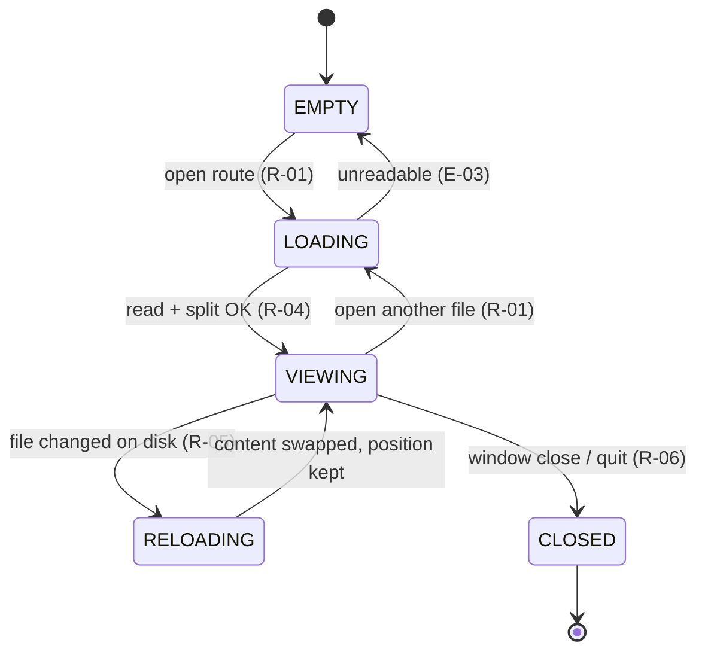
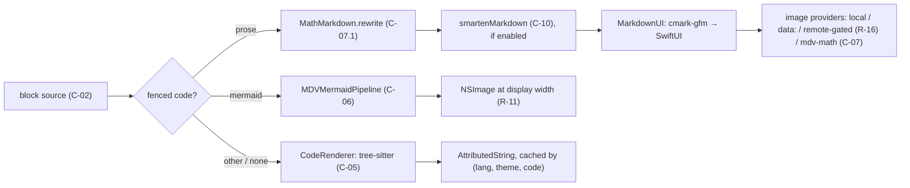

# SPECIFICATION — mdv (Markdown viewer, native macOS GUI + CLI launcher, Swift/SwiftUI)

> - **Status:** v0.1 — as-built specification of the system at commit `a6feb14` (branch `main`, 2026-09-14), drafted for review
> - **Language / stack:** Swift 5.9 (SwiftPM, no Xcode project) | SwiftUI + AppKit | MarkdownUI 2.4.1 (cmark-gfm) · SwiftTreeSitter 0.8 + nine vendored tree-sitter grammars · beautiful-mermaid-swift 1.0.4 (ELK layout) · SwiftMath 1.7.3 (vendored, patched) · SQLite (FTS5) | surfaces: macOS app bundle, `bin/mdv` shell launcher, `make` targets
> - **Sources:** `README.md`; `mdv/Help.md` (user-facing behaviour); `NOTES.md` (library gaps and their work-arounds); `TYPOGRAPHY.md` (theme conventions); `plans/CODEVIEW.md` (code-block design); `Vendor/SwiftMath/README.md`; the implementation in `mdv/*.swift`, `bin/mdv`, `build.sh`, `Makefile`, `Package.swift`, `.github/workflows/build.yml`; git history through `a6feb14`
> - **Scope of this document:** the observable behaviour of the mdv application and its launcher — file opening, rendering (Markdown, code, Mermaid, LaTeX), navigation, find and search, history, bookmarks, persistence, theming, packaging and release. It does **not** specify the internals of the third-party renderers beyond the contracts mdv relies on, nor the visual design values of individual themes (those live in `TYPOGRAPHY.md`).
> - **Normative language:** MUST/MUST NOT/SHALL/SHALL NOT = normative; SHOULD = strong recommendation; MAY = optional.
> - **Principle:** *Native and honest.* Every pixel is drawn by AppKit/SwiftUI/CoreText — no WebView, no JavaScript bridge — and when a renderer cannot handle an input, the user sees the source, never a blank.

---

## 0. Intent and purpose

mdv is a macOS application for *reading* Markdown. It renders a `.md` file the way a good document viewer renders a PDF: typographically deliberate, fast to open, with the navigation aids a long technical document needs (table of contents, in-document find, cross-file full-text search, bookmarks, back/forward history) and without any editing surface. It is meant to be the default handler for `.md` files on a developer's Mac, reachable from Finder, from the terminal (`mdv FILE`), and from other Markdown files via links.

The renderer is a pipeline of native components: cmark-gfm (via MarkdownUI) for Markdown, tree-sitter for code syntax highlighting, an ELK-based layout library for Mermaid diagrams, and a CoreText math typesetter for LaTeX. Each of those libraries has gaps relative to what real documents contain (Mermaid.js syntax, amssymb, `<br/>` in labels, …); mdv owns a **sanitising and repair layer** in front of each one so that documents written for GitHub or Mermaid.js render faithfully, and a **fallback rule** so that anything the layer cannot repair is shown as its source text with an explanation rather than dropped.

**Non-goals.** mdv does not edit Markdown (it hands off to an external editor); it does not render HTML blocks beyond what cmark-gfm passes through as text; it does not fetch remote images unless the user opts in; it does not sync anything off the machine; it is not sandboxed for the App Store (it reads arbitrary user files and installs a CLI symlink).

**Trust boundary.** Everything the application processes — file contents, link targets, image URLs, Mermaid and LaTeX source — is untrusted document content. The only network activity is the user-enabled remote-image fetch (R-16) and the release pipeline (§10). The application never executes document content.

## 1. Actors and goals

| Actor | Goals |
| ----- | ----- |
| **Reader** (human, GUI) | Open Markdown files by any route, read them with good typography, move around them quickly, find text within and across files, keep places, and get back to files read before. |
| **Terminal user** (human, `bin/mdv`) | Open one or more files, a directory, or stdin from a shell in the running application; query the version; install the launcher once. |
| **Finder / LaunchServices** (`com.mdv.app` document-type registration) | Route double-clicks, drag-onto-icon, and `open -a` of `.md`/`.markdown`/`net.daringfireball.markdown`/`public.plain-text` items into the application. |
| **External editor** (any macOS app the reader chooses) | Receive the current file on ⌘E; its saves are picked up by the live-reload watcher. |
| **Document author** (indirect) | Their GitHub-flavoured Markdown, Mermaid.js diagrams, and LaTeX math render as they would on GitHub / mermaid.live, or degrade visibly. |
| **Release engineer** (human, `make dist`, CI) | Produce a signed, notarised, stapled `.zip` from an exact `vX.Y.Z` tag; CI builds every push to `main` and publishes a rolling `latest` prerelease. |
| **Persistence store** (SQLite at `~/Library/Application Support/mdv/mdv.db`, `UserDefaults`) | Durably hold history, the full-text index, bookmarks, per-file scroll positions, and preferences across launches. |

## 2. Requirements (intent, high level)

Sources are cited as `[Help §…]`, `[README]`, `[NOTES]`, or a file path in `mdv/`.

### 2.1 Opening and loading

| ID | Statement |
| -- | --------- |
| **R-01** | The application MUST open a Markdown file from every one of: File → Open… (⌘O), Open in New Window… (⌘⇧O), a LaunchServices open event (Finder double-click, drag onto the icon, `open -a`), a file dropped onto the window, a same-directory Markdown link clicked inside a document, a history-sidebar row, a search hit, and a bookmark. All routes MUST load the file into the active window's content view; only ⌘⇧O creates a window. `[Help §Opening files; mdv/mdvApp.swift application(_:open:)]` |
| **R-02** | When the opened path is a **directory**, the application MUST load `README.md` (case-insensitive match on the stem) if present, else the alphabetically-first file whose extension is `md`, `markdown`, or `mdown`, and MUST add every other such file in that directory to history as a sibling (R-20). `[Help §Opening files; ContentView.loadDirectory]` |
| **R-03** | A dropped item MUST be accepted only when its extension (case-insensitive) is one of `md`, `markdown`, `txt`, `mdown`, `mkd`; other drops MUST be ignored without error. `[ContentView.handleDrop]` |
| **R-04** | The file MUST be read as UTF-8. The document MUST be split into **blocks** once per load (C-02) and every per-frame consumer (rendering, find, TOC, bookmarks) MUST read the cached split, never re-parse. `[ParsedDocument; commit 38df878]` |
| **R-05** | While a file is displayed, the application MUST watch it and reload its content when the file changes on disk, coalescing bursts of change events within 50 ms into one reload. A reload MUST keep the reader's scroll position. `[FileWatcher; Help §Editor integration]` |
| **R-06** | On load, the application MUST restore the reader's last scroll position for that path (C-08) when the stored anchor still resolves (E-08); otherwise it MUST start at the top. On window close or quit it MUST persist the current position. `[ContentView.persistScrollPosition]` |

### 2.2 Rendering

| ID | Statement |
| -- | --------- |
| **R-07** | Markdown MUST be rendered as GitHub-flavoured Markdown (cmark-gfm: tables, task lists, strikethrough, autolinks, footnotes) using the active theme's typography (R-27). `[README; ThemeManager.markdownTheme]` |
| **R-08** | Fenced code blocks MUST be syntax-highlighted with tree-sitter for the languages in K-05 (with the alias map in C-05), and MUST render as plain monospaced text — never an error — for any other or missing language hint. The block MUST show a language label, a hover-revealed toolbar (wrap toggle, copy), and a context menu; blocks in a shell language whose lines are at least half `$ `/`# `-prompted MUST additionally offer *Copy Without Prompts*. `[CodeRenderer; CodeBlockChrome]` |
| **R-09** | A ` ```mermaid ` fence MUST render as a diagram image drawn natively (C-06). The block MUST offer: a style menu (Document, Light, Dark, Tokyo Night, Catppuccin — the choice persisted document-wide in `mdv.mermaid.style`), *Show Mermaid source* (toggles to a highlighted source view), *Export diagram as PNG*, copy source, and pinch-to-zoom between $0.5\times$ and $4\times$. `[Help §Diagrams and math; MermaidCodeBlockChrome]` |
| **R-10** | Before parsing, Mermaid source MUST be sanitised per C-06.1 so that the Mermaid.js constructs listed there render; after layout, the corrections in C-06.2 MUST be applied. A diagram whose source the library cannot parse (e.g. `timeline`, `gantt`, `pie`, `mindmap`) MUST render the fallback: the text "Mermaid diagram could not be rendered" and the source in monospace. `[NOTES §Mermaid]` |
| **R-11** | A diagram MUST be rasterised at the exact width it is displayed at — its natural width, or the column width minus 36 pt if narrower, floored to whole points — at the screen's backing scale, and re-rasterised when that width or the committed zoom changes. It MUST NOT be drawn wider than its natural width. `[NOTES §Resolution; MDVMermaidDiagramView]` |
| **R-12** | LaTeX math delimited by `$…$` (inline) and `$$…$$` (display) MUST be typeset natively with SwiftMath in every block type — paragraphs, headings, list items, blockquotes, table cells — following the delimiter rules in C-07. Display math on its own paragraph MUST be centred and MUST offer *Copy LaTeX* in its context menu. `[Help §Diagrams and math; MathRenderer]` |
| **R-13** | Math inside an ATX heading MUST be sized by that heading's em factor (C-09); elsewhere by the body size times the zoom factor (R-30). Math colour MUST be the theme's text colour. `[MathMarkdown.rewrite]` |
| **R-14** | LaTeX that SwiftMath rejects MUST render as its source (`$…$` delimiters included) in monospace; a display block MUST additionally show the parser's message. Before typesetting, the command rewrites and symbol registrations of C-07.2 MUST be applied. `[MathImageCache.typeset; MathSymbols]` |
| **R-15** | A node label in a Mermaid flowchart or state diagram that is exactly one `$$…$$` span MUST be typeset with SwiftMath and composited centred in the node at the same pixel weight as document math (I-009). Math mixed with text, and math in edge labels, MUST be rendered as the Unicode approximation of C-07.3. `[NOTES §LaTeX in labels]` |
| **R-16** | Images MUST resolve `data:` URIs inline and relative paths against the document's directory. `http(s)` images MUST NOT be fetched unless View → *Load Remote Images* is on; when off, a clickable "Remote image blocked" placeholder MUST be shown instead. A missing local image MUST show an "image not found" placeholder naming the file. An image MUST NOT be scaled above its intrinsic size. `[LocalImageProvider; mdvApp View menu]` |
| **R-17** | When View → *Smart Typography* is on **and** the active theme allows it, prose blocks MUST be rendered with curly quotes, en/em dashes, and ellipses per C-10; fenced/inline code, GFM table blocks, thematic-break lines, link URLs, and `<…>` spans MUST be left verbatim. Math spans MUST be rewritten to image references *before* smartening so LaTeX is never altered. `[SmartTypography.swift; ContentView.blockView]` |

### 2.3 Navigation and selection

| ID | Statement |
| -- | --------- |
| **R-18** | The application MUST maintain per-window back/forward stacks of visited files (⌘← / ⌘→, Navigate menu) and MUST push a snapshot before a same-document fragment jump so ⌘← returns to the previous position. `[Help §Moving around]` |
| **R-19** | Clicking a link MUST: navigate in-app when the target resolves to an existing local file with extension `md`/`markdown`/`mdown`; scroll to the heading whose GitHub-style slug (C-11) equals the fragment when the link is `#fragment`; and otherwise hand the URL to the system opener. Relative targets MUST be resolved by path arithmetic against the document's directory. `[ContentView.handleLinkClick]` |
| **R-20** | The history sidebar MUST list every file opened, most recent first, capped at 100 entries, persisted across launches; a row MUST support swipe-to-delete. The sidebar MUST be collapsible (⌃⌘S, View menu, hover chevron) with the collapsed state persisted, and resizable by dragging its divider between 180 and 400 pt. `[HistoryManager; Help §Sidebars]` |
| **R-21** | The inspector MUST show a table of contents of the document's single-line ATX `#`, `##`, `###` headings (C-02), each row jumping to its block, with a search field that filters rows; and a collapsible bookmarks pane with a draggable height. The inspector's visibility and width (180–520 pt, dragged at its left edge) MUST persist. Heading text in the TOC MUST show math as Unicode (C-07.3), not as LaTeX source. `[Help §Sidebars; commit bcd2150]` |
| **R-22** | Reader text selection MUST work as in any text view, and additionally: a single click on a heading MUST copy that heading's section (C-12) as Markdown to the pasteboard and flash the section for 0.6 s; a double-click MUST select the section; a drag across blocks MUST select whole blocks, expanding to include any section whose heading falls in the range; ⌘A MUST select every block; ⌘C MUST copy the selected blocks' source joined by blank lines; Esc MUST clear the selection. `[commits bae06a7, c50817a]` |
| **R-23** | ⌘E MUST open the current file in the chosen external editor; File → Edit → *Choose Editor…* picks one and *Forget Editor* clears it; with no editor set, ⌘E MUST prompt to choose. `[Help §Editor integration]` |

### 2.4 Find, search, bookmarks

| ID | Statement |
| -- | --------- |
| **R-24** | ⌘F MUST open an in-document find bar. Matching MUST be case-insensitive substring over each block's source; the bar MUST show "*n* of *m*" (or "No matches"), ⌘G / ⇧⌘G MUST step forward/back and scroll the match into view, Esc MUST close. Blocks that are paragraphs, headings, lists, or blockquotes MUST highlight the matched characters; code, table, and image blocks MUST instead be tinted as a whole. When the sidebar (not the document) was last focused, ⌘F MUST route to the global search field. `[Help §Find; ContentView find]` |
| **R-25** | ⌘⇧F MUST focus a search field that queries the full-text index of every file in history (C-03): tokens are prefix-matched and ANDed; results (at most 80) MUST show the filename and a snippet with matched terms highlighted; choosing a result MUST open the file. `[Help §Find; Database.search]` |
| **R-26** | The application MUST index a file's content into the full-text index when it is opened and re-index history on launch, skipping any file whose modification time is unchanged since its last indexing. `[Database.indexFile]` |
| **R-27** | ⌘D MUST add a bookmark at the block currently at the top of the viewport, titled by the nearest preceding heading (or the filename), anchored by block index *and* fingerprint (C-08). Bookmarks MUST persist in order; the first five MUST be bound to ⌘1…⌘5 (Bookmarks menu shows their titles); rows MUST be reorderable by drag and removable. Opening a bookmark MUST load its file if needed and scroll to the resolved anchor (E-08). `[Help §Bookmarks; BookmarksManager]` |
| **R-28** | ⌘⇧0 MUST set a transient in-memory placeholder at the current spot and ⌘0 MUST return to it; the placeholder MUST NOT survive relaunch. `[Help §Bookmarks]` |

### 2.5 Appearance and preferences

| ID | Statement |
| -- | --------- |
| **R-29** | The reader MUST be able to choose one of the nine named themes or *System* from the toolbar; *System* MUST resolve to `high-contrast` in Light appearance and `twilight` in Dark and MUST switch live when macOS appearance changes. Each theme MUST restyle the article pane, code palette, and the diagram *Document* style; the choice MUST persist (`mdv_theme_id`). `[ThemeManager; TYPOGRAPHY.md]` |
| **R-30** | ⌘= / ⌘- MUST scale body text by $\pm 0.10$ per step, clamped to $[0.60, 2.50]$; View → Actual Size MUST reset to $1.0$; the factor MUST persist (`mdv_font_scale`) and MUST also scale document math (R-13). A zoom HUD MUST show the percentage for about 0.9 s after each change. `[ThemeManager fontScale]` |
| **R-31** | ⌘? (Help → mdv Help) MUST open the bundled `Help.md`, copied on demand to `~/Library/Application Support/mdv/Help.md` so it has a stable path for history and bookmarks. `[HelpManager]` |
| **R-32** | Every preference in C-04 MUST persist via `UserDefaults` under the listed key and MUST be honoured on the next launch. |

### 2.6 Launcher, packaging, diagnostics

| ID | Statement |
| -- | --------- |
| **R-33** | `bin/mdv` MUST implement the surface in §5.2: locate the app bundle per the documented search order, open files/directories by absolute path, read stdin into a temporary `.md` for `-`, print the bundle version for `--version`, and exit `1` with `mdv: no such file: <path>` on stderr for a missing argument. `[bin/mdv]` |
| **R-34** | `make` (default) MUST build a runnable `build/mdv.app` from a clean checkout with only the Swift toolchain, copying every resource the app needs (C-13); `make install` MUST place it in `/Applications`, register it with LaunchServices, and symlink the CLI; `make dist` MUST refuse to run unless `HEAD` carries an exact `vX.Y.Z` tag. `[Makefile; build.sh]` |
| **R-35** | The application MUST NOT print document content, file contents, or query strings to any log at any verbosity. The only diagnostics it emits are `NSLog` lines on persistence-store failures (E-12) and the font-registration lines SwiftMath prints once per font on first use. |
| **R-36** | The application MUST NOT crash on any document: a repair layer failure MUST degrade to the fallback of R-10/R-14, and every path that reaches a third-party parser MUST be preceded by the sanitisation that keeps that parser inside its asserted invariants (E-01). `[NOTES §Mermaid: ELK layout asserts]` |

## 3. Behavior and state model

### 3.1 Document lifecycle

A window holds at most one **current document**. Its states and transitions:

| State | Meaning | Enters via | Leaves via |
| ----- | ------- | ---------- | ---------- |
| `EMPTY` | No file loaded; the drop target / Open… prompt is shown. | launch with no file; history cleared | any open route (R-01) → `LOADING` |
| `LOADING` | File read from disk, split into blocks (C-02), history row added (R-20), file indexed (R-26), scroll anchor looked up (R-06). | open route | success → `VIEWING`; unreadable file → `EMPTY` (E-03) |
| `VIEWING` | Blocks rendered lazily; watcher armed (R-05); find/TOC/bookmarks operate on the cached split. | `LOADING` | open of another file → `LOADING`; file changed on disk → `RELOADING`; window close → `CLOSED` |
| `RELOADING` | New content replaces `rawMarkdown` in place; scroll position kept; selection cleared. | watcher event, coalesced 50 ms | → `VIEWING` |
| `CLOSED` | Scroll position persisted (R-06); watcher cancelled. | window close, quit | terminal |



*Figure 3.1 — document lifecycle per R-01, R-04..R-06, E-03. The table is normative; the diagram is illustrative.*

### 3.2 Render pipeline for one block

Every visible block goes through the same path on each render (the split itself happens once per load, R-04):



*Figure 3.2 — per-block render path per R-07..R-17. Each edge corresponds to a §4 contract; the diagram is illustrative.*

Order matters in one place and is normative: **math rewriting precedes smart typography** (R-17), so that `--`, `...`, and quotes inside `$…$` are never curled or dashed.

### 3.3 Durable artifacts

| Artifact | Location | Written when | Read when |
| -------- | -------- | ------------ | --------- |
| History list | `UserDefaults["mdv_history"]` (JSON, ≤ 100 entries) | every open, delete, clear | launch |
| Full-text index | `mdv.db` tables `articles`, `articles_fts` (C-03) | every open (mtime-gated), launch re-index | ⌘⇧F search |
| Bookmarks | `mdv.db` table `bookmarks` (C-08) | ⌘D, reorder, remove | launch, Bookmarks menu, inspector |
| Scroll positions | `mdv.db` table `scroll_positions` (C-08) | window close / quit / file switch | file load |
| Preferences | `UserDefaults` keys in C-04 | on change | launch |
| Help file | `~/Library/Application Support/mdv/Help.md` | first ⌘? per launch (copied from the bundle) | ⌘? |
| Render caches | in-memory only: code `AttributedString` (256 entries), math images (2048), Mermaid layouts (96) and rasters (192, ≤ 192 MB) | render | render |

`mdv.db` MUST be opened with `SQLITE_OPEN_FULLMUTEX`, `journal_mode = WAL`, `synchronous = NORMAL` (I-006).

## 4. Interfaces / contracts

### C-01 Application bundle and document types

```
mdv.app/
  Contents/Info.plist        CFBundleIdentifier com.mdv.app, LSMinimumSystemVersion 13.0,
                             CFBundleShortVersionString 1.0.0
                             CFBundleDocumentTypes: extensions [md, markdown];
                             LSItemContentTypes [net.daringfireball.markdown, public.plain-text]
  Contents/MacOS/mdv         SwiftPM executable
  Contents/Resources/        AppIcon.icns · *.otf (Alegreya, Besley, OpenDyslexic) ·
                             *-highlights.scm (9) · mathFonts.bundle/ (Latin Modern Math + plist)
                             · mdv (CLI script, for "Install Command Line Tool…") · Help.md
Entitlements: app-sandbox = false; files.user-selected.read-only = true
```

### C-02 Document split: `ParsedDocument`

```swift
struct ParsedDocument {            // computed once per load (R-04); equality on `raw`
    let raw: String
    let blocks: [String]           // see rules
    let tocHeadings: [TOCHeading]  // level 1…3, single-line ATX only
}
struct TOCHeading { level: Int; text: String /*display*/; slugText: String /*for #fragment*/; blockIndex: Int }
```

Split rules (normative):

1. Input is split on `\n`. A **blank line** (only whitespace) ends the current block.
2. A line whose first non-space characters are ` ``` ` or `~~~` opens a **fence**; blank lines inside a fence do not split; the fence closes at the next line starting (after spaces) with the same marker.
3. A line whose first non-space characters are `$$`, with no second `$$` on the same line, opens a **math fence**; it closes at the next line *containing* `$$`.
4. Leading/trailing newlines of a block are trimmed; empty blocks are dropped.
5. `tocHeadings` contains each block whose trimmed text starts with `# `, `## `, or `### ` and is not a fence, using its first line only. `text` is the line with inline Markdown stripped (C-12 rules) and math converted per C-07.3; `slugText` is the same without the math conversion.

### C-03 Full-text index

```sql
CREATE TABLE articles (id INTEGER PRIMARY KEY, path TEXT NOT NULL UNIQUE, filename TEXT NOT NULL,
    content TEXT NOT NULL DEFAULT '', indexed_at INTEGER NOT NULL,
    file_mtime INTEGER NOT NULL DEFAULT 0, file_size INTEGER NOT NULL DEFAULT 0);
CREATE VIRTUAL TABLE articles_fts USING fts5(filename, content, path UNINDEXED,
    content='articles', content_rowid='id', tokenize='unicode61 remove_diacritics 2');
-- triggers keep articles_fts in step with INSERT/UPDATE/DELETE on articles
```

Query construction: split the input on whitespace; drop the characters `" ( ) : * ^` from each token; wrap each remaining token as `"token"*`; join with spaces (FTS5 implicit AND). Results: `ORDER BY rank LIMIT 80`, with `snippet(articles_fts, 1, char(2), char(3), '…', 14)` — U+0002/U+0003 bracket matched terms and the UI renders them highlighted.

### C-04 Preferences (`UserDefaults`)

| Key | Type | Default | Meaning |
| --- | ---- | ------- | ------- |
| `mdv_theme_id` | String | `high-contrast` | Theme id or `system` (R-29) |
| `mdv_font_scale` | Double | `1.0` | Zoom factor (R-30), clamped on read |
| `mdv_smart_typography` | Bool | `true` | View → Smart Typography (R-17) |
| `mdv_load_remote_images` | Bool | `false` | View → Load Remote Images (R-16) |
| `mdv_sidebar_collapsed` | Bool | `false` | History sidebar hidden (R-20) |
| `mdv_inspector_visible` | Bool | `false` | TOC/bookmarks inspector shown (R-21) |
| `mdv_inspector_width` | Double | `240` | Inspector width, clamped to $[180, 520]$ |
| `mdv_bookmarks_expanded` | Bool | — | Bookmarks pane open |
| `mdv_bookmarks_height` | Double | — | Bookmarks pane height, clamped at use |
| `mdv_editor_app_path` | String | `""` | External editor bundle path (R-23) |
| `mdv_history` | Data (JSON) | `[]` | History entries (R-20) |
| `mdv.mermaid.style` | String | `document` | Diagram style (R-09) |

### C-05 Code highlighting: `CodeRenderer`

```swift
func render(code: String, languageHint: String?, theme: MDVTheme) -> AttributedString   // synchronous, never throws
```

- Language resolution: lower-case the info string, keep its first word; direct names `c go rust bash javascript yaml toml python ruby`; aliases `js jsx javascriptreact node → javascript`, `sh zsh shell → bash`, `py python3 → python`, `rb → ruby`, `yml → yaml`, `rs → rust`, `golang → go`, `h objective-c objc → c`; anything else → plain.
- Highlighting: parse with a fresh `Parser` per call, run the grammar's `highlights.scm`, colour each capture from the theme's `CodePalette` by capture-name components; `comment` captures are italic. If the query fails to compile, that language falls back to plain for the rest of the session.
- Result cache: key `(language, theme id, hash(code))`, at most 256 entries.

### C-06 Mermaid pipeline: `MDVMermaidPipeline`

```swift
static func prepare(source: String, theme: DiagramTheme) throws -> MDVMermaidPrepared  // parse → repair → layout (ELK)
static func rasterize(_ p: MDVMermaidPrepared, width: CGFloat, scale: CGFloat) -> NSImage?  // CoreText at final size, upright
static func displaySize(for p: MDVMermaidPrepared, width: CGFloat) -> CGSize  // whole points; shared by view and raster
```

**C-06.1 Source sanitisation (before parsing), in this order:**

| # | Rule | Reason |
| - | ---- | ------ |
| 1 | Drop a leading YAML front-matter block (`---` … `---`). | parser rejects it (`invalidHeader`) |
| 2 | xychart: `line "name" [...]`/`bar "name" [...]` → `line [...]`/`bar [...]`. | parser knows only the unnamed form |
| 3 | On `style`/`classDef`/`linkStyle` lines: expand `#rgb`/`#rgba` to 6/8 digits; map CSS colour names (white, black, red, … transparent) to hex. | 3-digit hex and names render **black** |
| 4 | stateDiagram: fold every `ID: text` description line for an ID into one `state "a<br/>b" as ID` alias inserted after the header. | parser keeps only the first registration |
| 5 | `id[/text/]` and `id[\text\]` (parallelograms) → `id[text]`. | not in the parser's shape table |
| 6 | Strip inline formatting tags `<b> <i> <u> <s> <strong> <em> <small> <sup> <sub> <span> <code> <tt> <font> <mark>` (open and close), keeping their content; leave `<br/>`. | rendered literally |

**C-06.2 Post-parse and post-layout repairs:**

| Diagram | Repair |
| ------- | ------ |
| flowchart, stateDiagram | Subgraph ownership: a node listed in several subgraphs belongs to the **last** one (Mermaid.js semantics); it is removed from the others. (Prevents the ELK `assert`, E-01.) |
| stateDiagram | `classDef`, `class A,B name`, and `style` lines read from the source are applied to the model (`classDefs`, `classAssignments`, `nodeStyles`). |
| flowchart, stateDiagram | Whole-label `$$…$$` nodes: label replaced by a blank placeholder measured to the math image's size; image composited after rasterising, centred, at a pixel-snapped origin (R-15, I-009). |
| sequenceDiagram | `<br>` → newline in notes; → space in actor labels; message labels with `<br>` are blanked and drawn by mdv, lines stacked upward from the arrow (13 pt pitch, 11 pt font, muted colour). |
| sequenceDiagram | Actor gaps widened until every message label fits between its endpoints (+ 24 pt; self-messages + 36 pt); all x coordinates remapped piecewise-linearly through old→new actor centres. |
| sequenceDiagram | Multi-line message rows: the message and everything below shifted down $(n-1) \times 13 + 4$ pt; spanning blocks, lifelines, and the diagram height grow. |
| sequenceDiagram | A block whose last item is a note is extended to enclose it (+ 8 pt). `autonumber` draws a filled disc (r = 8 pt) with the 1-based index at each arrow's tail. |

**C-06.3 Document theme.** The *Document* style derives a `DiagramTheme` from the active `MDVTheme`: background = code-block background, foreground = text colour, node surface = page colour mixed 25 % toward the code background on light themes (lifted 16 % toward foreground on dark), lines/borders/muted = fixed mixes of background and foreground.

### C-07 LaTeX math

**C-07.1 Rewriting.** `MathMarkdown.rewrite(block, fontSize, headingSizeEms, color)` replaces each math span in a prose block with an image reference

```
>?s=<size pt, 1 decimal>&c=<RRGGBBAA>)     // $…$, or $$…$$ mid-line
>?s=…&c=…)                                // $$…$$
```

A `$$…$$` whose opening is at line start and closing at line end is emitted as its **own paragraph** (blank lines inserted, indentation preserved) so MarkdownUI's block-image path renders it centred via `MathDisplayView`; every other span is an inline image via `MathInlineImageProvider`. Delimiter rules (Pandoc `tex_math_dollars`): an opening `$` is followed by non-whitespace; a closing `$` is preceded by non-whitespace and not followed by a digit; a span contains no bare `$` and never crosses a backtick; `\$` is literal; fenced blocks and inline code are never rewritten; an empty `$$` pair is literal.

**C-07.2 Typesetting.** `MathImageCache.rendered(for: MathSpec)` typesets with `MathImage(latex, fontSize, textColor, labelMode: display ? .display : .text)` after (a) registering the extra symbols and (b) applying the rewrites below, and bakes the result to a bitmap at the screen scale (I-008). Cache: 2048 entries keyed by the URL.

| (a) Registered symbols (Latin Modern Math has the glyphs) | (b) Command rewrites (regex, in order) |
| --- | --- |
| relations: `gtrsim lesssim gtrapprox lessapprox leqslant geqslant lll ggg nless ngtr nleq ngeq doteq triangleq therefore because implies impliedby models vDash Vdash nparallel nmid subsetneq supsetneq nsubseteq nsupseteq sqsubseteq sqsupseteq precsim succsim`; arrows: `hookrightarrow hookleftarrow rightharpoonup leftharpoonup rightleftharpoons leftrightharpoons nearrow searrow swarrow nwarrow longmapsto twoheadrightarrow rightsquigarrow leadsto rightrightarrows leftleftarrows`; ordinary: `dots dotsc dotsb varnothing hslash mho Box square blacksquare bigstar checkmark ddagger S P pounds copyright degree beth gimel wp nexists complement # _`; big operators: `iint iiint oiint bigsqcup bigodot bigotimes biguplus`; binary: `intercal leftthreetimes rightthreetimes divideontimes` | `\operatorname*{X}` → `\mathrm{X}`; `\dfrac`/`\tfrac` → `\frac`; `\boldsymbol` → `\bm`; `\bmod` → `\;\mathrm{mod}\;`; `\pmod{n}` → `\;(\mathrm{mod}\;n)`; `\not=` → `\neq`; `\big \Big \bigg \Bigg` (with optional `l r m`) before a delimiter → removed; `\coloneqq` → `:=`; `align*`/`equation*`/`gather*`/`multline*` → unstarred; `align` → `aligned`; `multline` → `gather`; `\begin{equation}`/`\end{equation}` → removed |

`\boxed{…}` is implemented in the vendored SwiftMath (`MTBoxed` atom, `MTBoxDisplay`: frame of fraction-rule thickness with $0.35\,\mathrm{em}$ padding). Unsupported and shown as source: `\underbrace`, `\overbrace`, `\stackrel`, `\substack`, `\&`.

**C-07.3 Plain-text form** (`MathMarkdown.plainText`), used by the TOC, bookmark titles, and mixed Mermaid labels: same delimiter rules; `\frac{a}{b}` → `a/b`, `\sqrt{x}` → `√x`, wrappers (`\text \mathrm \mathbf \mathit \mathcal \mathbb \operatorname \boldsymbol \bm \hat \vec \bar \tilde`) → their content; `^`/`_` followed by a character or `{…}` → Unicode super/subscript when every character has one (digits, `+ - n i` / `+ - i j n k x`), else kept verbatim; Greek letters, common relations/operators/arrows/sets → Unicode; unknown commands → their name; braces removed; whitespace collapsed.

### C-08 Anchors: bookmarks and scroll positions

```sql
CREATE TABLE bookmarks (id INTEGER PRIMARY KEY, path TEXT NOT NULL, title TEXT NOT NULL,
    sort_order INTEGER NOT NULL, created_at INTEGER NOT NULL,
    block_index INTEGER NOT NULL DEFAULT 0, block_fingerprint TEXT NOT NULL DEFAULT '');
CREATE TABLE scroll_positions (path TEXT PRIMARY KEY, block_index INTEGER NOT NULL,
    block_fingerprint TEXT NOT NULL, updated_at INTEGER NOT NULL, file_mtime INTEGER NOT NULL DEFAULT 0);
```

`fingerprint(block)` = the block's words joined by single spaces, lower-cased, truncated to 80 characters. `resolve(blocks, storedIndex, fingerprint)` = the first block whose fingerprint equals the stored one; else `storedIndex` clamped to $[0, |\mathrm{blocks}|-1]$; else 0 for an empty document. A scroll position is restored only when the stored anchor resolves **and** the file's modification time is within 1 s of the stored `file_mtime` **and** the index is in bounds (E-08).

### C-09 Theme contract (`MDVTheme`), the fields behaviour depends on

```swift
struct MDVTheme {
    let id: String; let isDark: Bool
    let text, secondaryText, tertiaryText, heading, strong, link, accent, background, secondaryBackground, border, divider, blockquoteBar: Color
    var bodyFontFamily: FontFamily; var baseFontSize: CGFloat            // default 16
    var h1SizeEm = 1.75, h2SizeEm = 1.4, h3SizeEm = 1.15; h4SizeEm 1.0, h5SizeEm 0.875, h6SizeEm 0.85 (fixed)
    var headingSizeEms: [CGFloat]     // [h1…h6], used by markdownTheme and by math in headings (R-13)
    var articleMaxWidth: CGFloat?; var articleHorizontalPadding: CGFloat
    var smartTypographyAllowed: Bool  // false for phosphor, standard-erin-light, standard-erin-dark
    var codePalette: CodePalette?     // default: oneDark (dark) / githubLight (light)
}
static let all = [highContrast, sevilla, charcoal, solariumDaylight, solariumMoonlight, phosphor, twilight, standardErinLight, standardErinDark]
```

Code blocks always use the system monospace face regardless of `bodyFontFamily` (`TYPOGRAPHY.md`).

### C-10 Smart typography (`smartenMarkdown`)

Applied to one block; the block is returned unchanged if it is a fence, looks like a GFM table (a `|---|` separator row), or is a thematic-break line. Otherwise, outside inline code spans (a run of *n* backticks closes only on a run of exactly *n*), link/image URL parts (`](` … matching `)`), and `<…>` spans: `"` and `'` → directional quotes chosen from the preceding character; `---` → `—`; `--` between letters/digits → `–`; ` -- ` → ` — `; other `--` runs unchanged (CLI flags survive); `...` → `…`.

### C-11 Heading slug

`slug(s)` = lower-case `s`; keep letters and digits; keep `-` and `_` when something precedes them; collapse runs of whitespace into one `-`; strip trailing `-`/`_`. Applied to both the link fragment and `TOCHeading.slugText`; equality selects the target.

### C-12 Section and inline-stripped text

`section(headingAt i)` = blocks $[i, j)$ where $j$ is the index of the next heading with level $\leq$ the level of $i$, or the block count. Copy output = those blocks joined with `\n\n`. `stripInlineMarkdown` removes trailing `#`s, `**`, `__`, backticks, unescaped `*`, word-internal `_…_` markers, and reduces `[text](url)` to `text`.

### C-13 Build outputs (`build.sh`)

```
swift build -c {debug|release}
build/mdv.app/Contents/{MacOS/mdv, Info.plist, Resources/{AppIcon.icns, *.otf, *-highlights.scm,
                        mathFonts.bundle/, mdv, Help.md}}
codesign --force --sign - --entitlements mdv/mdv.entitlements build/mdv.app     # ad hoc
```

The vendored SwiftMath resolves `mathFonts.bundle` from `Bundle.main` first and from `Vendor/SwiftMath/mathFonts.bundle` (by `#filePath`) when running unbundled (`swift run`).
