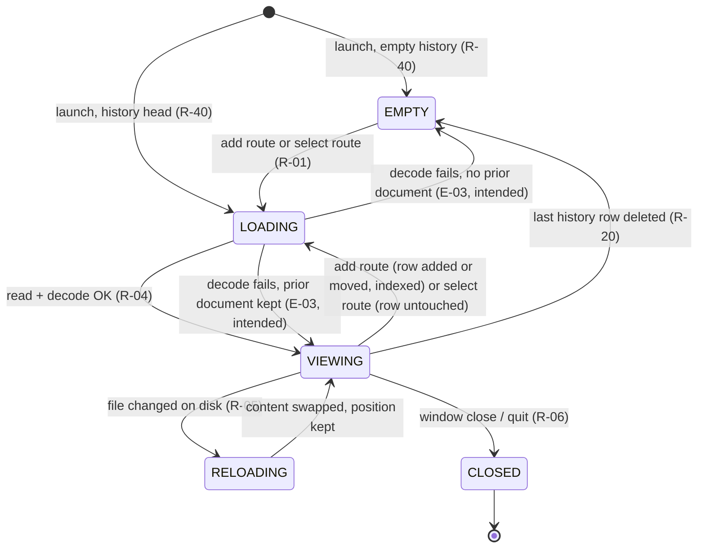

# Specification Review Report

> - **Subject:** `SPEC.md` v0.5 — mdv (Markdown viewer, native macOS GUI + CLI launcher)
> - **Reviewed at:** commit `a255106` (HEAD of `main`), 2026-09-14 — fourth pass, after F-001..F-061 were applied. The spec's front matter still names `fb5794b`; the one code commit since (`112fcaf`) is behaviour-neutral (see F-075).
> - **Method:** four passes per the `spec-review` skill. As in the previous passes, every precise behavioural claim not yet checked was verified against the cited implementation by reading the code; nothing was run. Surfaces swept this time: file loading (`loadFile`, `loadDirectory`, `loadCurrentEntry`), the history manager and FTS index lifecycle, the sidebar/search-hit/back-stack selection paths, the placeholder, zoom and the code renderer, the Mermaid sanitiser and document theme, the math URL contract, the launcher script, the Makefile and CI. Finding ids continue from F-062; F-001..F-061 are listed as resolved in §3 and not re-argued.

## 1. Executive Summary

v0.5 closed the third pass as intended: R-40 and the §3.1 entries now describe the real first screen, the five *open defect* markers (F-042, F-045, F-048, F-051, F-052) are in §11 with a stated fix each, and the MEDIUM rules of the third pass (bookmark title, "TOC heading block", find count-vs-highlight, snapshot policy, delete-current-row, multi-URL open) read as the code behaves. The renderer contracts (§4), the §7.1 metric, the launcher (§5.2), the build chain (§5.3, C-13) and CI were re-verified line by line and hold.

This pass swept the last surface that had not been read against the code — **how a document gets loaded and how history and the index follow it** — and found the same class of defect as the earlier passes, in two places that matter and five that are smaller:

1. **An unreadable-as-UTF-8 file is not refused.** `loadFile` guards only existence and permission; the UTF-8 decode happens later in `loadCurrentEntry`, whose failure branch sets `rawMarkdown = ""`. Result: the history row is added and selected, the watcher is armed, the index skips the file silently, and the window shows the "No file open" drop target — not the previous document. R-04, E-03, §3.1, D-16 and T-39 all say the opposite, and §11 lists E-03 as verified. The same branch is reached when a sidebar row, ⌘← or ⌘0 targets a file deleted since, and by any genuinely empty file.
2. **Three open routes do not add a history row.** Selecting a sidebar row, choosing a search hit already in history, and ⌘←/⌘→ assign `selectedEntry` directly, so the row is not moved to the top and the file is not re-indexed; §3.1 `LOADING` says every entry adds a row and indexes, R-20 says "most recent first", and T-24's "re-indexed on next open" only holds for the routes that go through `history.add`. ⌘← can also display an entry that was swipe-deleted, with no sidebar row.

The MEDIUM findings are rules an implementer would otherwise guess: the FTS index keeps files evicted by the 100-entry cap (R-26's "exactly the current history" is false after the 101st file); fenced code blocks do not zoom (R-30 is silent, T-11 implies they do); "shell language" for *Copy Without Prompts* is an undocumented six-name set; K-13's column-width formula applies the 860 pt cap before subtracting the padding, not after; and a mid-line `$$…$$` is emitted with the `display/` host and typeset in display style, where C-07.1 says `inline/`.

- **Maturity:** Level 2 — the same one-fix-away position as v0.4, on a different surface.
- **Readiness:** READY WITH MINOR FIXES.
- **Findings this pass:** 0 CRITICAL · 2 HIGH · 5 MEDIUM · 7 LOW (14). Cumulative: 75, of which 61 resolved.
- **Strengths:** §4 contracts and §5.2/§5.3 match the tree exactly; the *open defect* convention is used consistently; the §3.1 table is now the right shape and only needs its `LOADING` row split.
- **Weaknesses:** the loading path was specified from the E-03 intent ("unreadable → abort") rather than from `loadFile`/`loadCurrentEntry`; "opened" is used in R-20/R-26/§3.1 for two different things (adding a row vs. selecting one).

## 2. Overall Maturity

**Level 2 — Implementable.** A coding agent building from v0.5 would refuse a Latin-1 file (spec) where the app shows an empty window with a new history row (code), and would move a sidebar-selected file to the top of history and re-index it (spec) where the app leaves both alone (code). Both are common paths a verifier hits in the first hour (T-24, T-25, T-39). Each is a sentence plus a status marker away; with F-062/F-063 resolved and the five MEDIUM rules pinned, the document meets the Level 3 bar. Nothing found this pass touches the renderer, persistence schema, or packaging.

## 3. Findings Summary

### Resolved from earlier passes

F-001..F-061 — all applied (see `SPEC.md` revision history). Spot-checked this pass: F-043 (R-40 and the `EMPTY`/`LOADING` entries match `ContentView.onAppear`, `mdv/ContentView.swift:522-532`), F-044 (`bookmarkTitle` 40/60/`(line n)`), F-049/F-050 (`pushSameDocSnapshot` callers; `delete(_:)` selects `history.entries.first`, `mdv/ContentView.swift:953-959`), F-053 (`application(_:open:)` posts one notification per URL in order; `handleDrop` takes `providers.first`), F-055 (Back/Forward never disabled; `jumpToPlaceholder` beeps), F-057 (`kFSEventStreamCreateFlagNoDefer`, latency `0.05`), F-058 (`HelpManager` overwrites), F-060 (`localizedCaseInsensitiveCompare`, `skipsHiddenFiles`, `isReadableFile`).

### New in v0.5

| ID | Severity | Location | Title |
| -- | -------- | -------- | ----- |
| F-062 | HIGH | R-04, E-03, §3.1, D-16, T-39, §11 | A file that exists but is not UTF-8 (or vanishes before the read) gets a history row and an empty window, not an aborted load |
| F-063 | HIGH | §3.1 `LOADING`, R-01, R-20, R-26, R-18, T-24, T-25 | Sidebar row, search hit and ⌘←/⌘→ select an entry without adding a history row or re-indexing |
| F-064 | MEDIUM | R-26, I-013, K-03, T-25 | Files evicted by the 100-entry cap stay in the full-text index |
| F-065 | MEDIUM | R-30, C-05, T-11 | Fenced code blocks do not scale with ⌘=/⌘-; the spec is silent |
| F-066 | MEDIUM | R-08 | "Shell language" for *Copy Without Prompts* is undefined; as built it is `bash sh zsh fish shell console` on the raw fence word |
| F-067 | MEDIUM | K-13, R-11, T-18 | Column width: `articleMaxWidth` caps the padded frame, so the content width is $860 - 2 \cdot 40 - 2 \cdot 6$ pt, not 860 |
| F-068 | MEDIUM | C-07.1, K-08, E-16 | A mid-line `$$…$$` is emitted with the `display/` host and typeset in `.display` mode; C-07.1 says `inline/` |
| F-069 | LOW | R-06, R-26, C-08 | Swipe-deleting a history row also deletes the path's scroll position |
| F-070 | LOW | C-04, R-29, R-30, K-06 | Stored-value edge cases: zoom is snapped to one decimal on step, an unknown theme id resolves to `high-contrast` but stays selected, index mtime compares whole seconds |
| F-071 | LOW | R-24, R-05 | Find state across a live reload is recomputed and the current occurrence resets to the first; the query is matched untrimmed |
| F-072 | LOW | §5.3, §10, §1 | Release-engineer inputs (`CERT_NAME`, `TEAM_ID`, `NOTARY_PROFILE`, `NOTES_FILE`, `VERSION`) are not in the spec |
| F-073 | LOW | §5.2, R-33 | `mdv -` only as the sole argument; the first missing argument stops the loop; `--help`/`--version` still need a located bundle |
| F-074 | LOW | R-28, R-18, E-09 | ⌘0 or ⌘← to a file that no longer exists: silent no-op (⌘0) or empty window (⌘←), where a bookmark beeps |
| F-075 | LOW | front matter, §3.3, §11, C-06.1, C-07.2, C-12 | Editorial: stale as-built commit, "clear" in §3.3, `initialURL` citation, unstarred `\operatorname`, "next heading" in C-12, colour-name prefix rule |

## 4. Detailed Findings

### F-062 — A file that exists but is not UTF-8 (or vanishes before the read) gets a history row and an empty window

**Severity:** HIGH

**Location:** R-04 ("a file that is not valid UTF-8 is unreadable (E-03, D-16)"); E-03 ("Load aborted; window keeps its previous document; no history entry added"); §3.1 `LOADING` ("unreadable file → the previous state … no history change"); D-16; T-39 ("does not open and the window keeps its previous document"); §11 rows E-03 and R-04 (plain, i.e. verified)

**Observation**

`loadFile` (`mdv/ContentView.swift:2503-2513`) checks `fileExists` and `isReadableFile` — both permission-level — then calls `history.add(path:)` and sets `selectedEntry`. The bytes are read only in `loadCurrentEntry` (`mdv/ContentView.swift:2743-2747`):

```swift
if let content = try? String(contentsOf: url, encoding: .utf8) {
    rawMarkdown = content
} else {
    rawMarkdown = ""
}
```

`markdownView` shows `emptyState` — the "No file open / Drag and drop, or press ⌘O" panel — whenever `rawMarkdown.isEmpty` (`mdv/ContentView.swift:1245-1248`). So for a Latin-1 file, or a file deleted between the existence check and the read: the history row is added at the top and selected in the sidebar, the watcher is armed on the path, `_indexFile` skips it silently (`mdv/Database.swift:429`), and the window shows the drop target with no message. The previous document is gone. The same branch runs when a sidebar row (F-063), ⌘← or ⌘0 targets a path deleted since, and for any zero-byte `.md` file, which therefore also displays "No file open" while a file is, in fact, open.

**Why it matters**

E-03 is the failure model for the whole loading path, and §3.1 makes it a transition (`LOADING → previous state`). An implementer builds the abort; a verifier running T-39 expects the previous document and finds an empty window with a new row.

**Potential consequence**

T-39 fails as written; T-04's `chmod 000` case passes (that path is guarded), which hides the gap. A reader who opens a Windows-1252 file loses the document they were reading and gains a history row that can never be searched.

**Recommended resolution**

Decide per D-16 and mark the row. If the requirement stands (recommended — it is what E-03, D-16 and T-39 already say), mark E-03/R-04 *open defect* in §11 with the fix: read and decode in `loadFile` before `history.add`, abort on failure, and pass the decoded string to the entry load so the file is read once. Separately, state what an **empty** file displays — as built the "No file open" panel; the honest rule is an empty page with the file selected — and add the case to T-39. Add to §3.1 `VIEWING` → "selected entry unreadable at load (sidebar row, ⌘←, ⌘0) → as E-03".

### F-063 — Sidebar row, search hit and ⌘←/⌘→ select an entry without adding a history row or re-indexing

**Severity:** HIGH

**Location:** §3.1 `LOADING` ("history row added (R-20), file indexed (R-26)" — for every entry into the state); R-01 (lists "a history-sidebar row, a search hit" among the open routes); R-20 ("every file opened, most recent first"); R-26 ("index a file's content … when it is added to history (opened, …)"); R-18 ("loads the file"); T-24 ("touch it → re-indexed on next open"); T-25

**Observation**

`selectedEntry` is assigned on six sites (`mdv/ContentView.swift`): `loadFile` and `loadDirectory` (`:2512`, `:2547`) go through `history.add`, which moves the row to the top, saves, and calls `Database.indexFile` (`mdv/HistoryManager.swift:27-40`). The other four do not: the sidebar `List(selection: $selectedEntry)` (`:651`), `openHit` when the hit's path is already in history (`:865-866`), `applySnapshot` for ⌘←/⌘→ (`:2228`), and `delete(_:)` (`:957`). None of them reorders history or re-indexes. Consequences:

- clicking the fifth sidebar row leaves it fifth; R-20's "most recent first" holds for *added* files only;
- a file edited on disk and re-opened from the sidebar keeps its stale FTS content until the next launch (`HistoryManager.init` re-indexes) — T-24's "re-indexed on next open" is true only for ⌘O/drop/link/bookmark/CLI opens;
- ⌘← after swipe-deleting the displayed row (§3.1 says the snapshot is pushed) sets `selectedEntry` to an entry that is no longer in `history.entries`: the document is shown, no sidebar row is selected, and the index has already dropped it.

**Why it matters**

The spec uses "opened" for two different operations. An implementer following §3.1 routes every selection through the add path (the natural reading), producing a sidebar that reorders on every click and an index refreshed on every selection — materially different from the tree, and arguably better. A verifier cannot run T-24 without knowing which route "open" means.

**Potential consequence**

T-24 passes or fails depending on the route the tester chooses; T-25's "most recent first" is untestable for sidebar clicks; the stale-index case is invisible until a search returns text the file no longer contains.

**Recommended resolution**

Split the routes in R-01 and §3.1: **adding routes** (⌘O, ⌘⇧O, LaunchServices/`bin/mdv`, drop, link, bookmark, placeholder, directory) add-or-move the row and index; **selecting routes** (sidebar row, search hit, ⌘←/⌘→, delete-current-row) display an entry without touching history order or the index. Reword R-20 to "most recently *added* first", R-26 to "on add and on launch", and T-24's "on next open" to "on next ⌘O". For the deleted-row snapshot, choose: drop snapshots whose entry is removed (recommended, one line in `delete(_:)`), or specify that ⌘← re-adds the row. Add a T-25 step: "click the third row: the order is unchanged".

### F-064 — Files evicted by the 100-entry cap stay in the full-text index

**Severity:** MEDIUM

**Location:** R-26 ("the search population is exactly the current history"); I-013; K-03; T-25

**Observation**

`HistoryManager.add` truncates `entries` to `maxEntries` (`mdv/HistoryManager.swift:34-36`) without calling `Database.removeFile` for the evicted path; `reindex(paths:)` at launch only refreshes listed paths and never prunes `articles`. After the 101st distinct open, ⌘⇧F still returns the evicted file; `openHit` then falls into its "shouldn't happen today" branch (`mdv/ContentView.swift:867-871`) and `loadFile`s it, re-adding the row. T-25 checks swipe-delete removal but not eviction.

**Why it matters**

R-26's population rule is a MUST an implementer will build (prune on evict, or prune at launch by set difference) and a verifier will test; the tree does neither.

**Potential consequence**

Search hits for files the reader deliberately let fall off the list; a growing `mdv.db` for heavy users.

**Recommended resolution**

Mark R-26 *open defect* (fix: `removeFile` for each evicted path in `add`, and a launch-time `DELETE FROM articles WHERE path NOT IN (…)`), or narrow R-26 to "swipe-delete removes; eviction does not". Add a T-25 step: "open 101 files; ⌘⇧F for a word unique to the first: no hit".

### F-065 — Fenced code blocks do not scale with ⌘=/⌘-; the spec is silent

**Severity:** MEDIUM

**Location:** R-30 ("scale body text … and MUST also scale document math"); C-05; T-11 ("body text, headings, and math grow together")

**Observation**

`CodeRenderer.render` sets the font to `theme.baseFontSize * 0.85` (`mdv/CodeRenderer.swift:82`, `:132`, `:146`) — the theme's unscaled base — inside the `AttributedString`, and the `.codeBlock` theme style deliberately applies no text style on top (`mdv/ThemeManager.swift:560-568`). `markdownTheme(scale:)` scales `bodySize` and the inline-code `FontSize(.em(0.90))` follows it. So at 150 % the prose is 24 pt, inline code 21.6 pt, and fenced code still 13.6 pt.

**Why it matters**

R-30 names what scales; a reasonable implementer scales everything typographic, including fences, and T-11 does not say otherwise. Two implementations differ visibly at every zoom level.

**Potential consequence**

A verifier at T-11 either passes or fails the fence depending on their reading; a reader zooming for legibility gets the one block type that does not move.

**Recommended resolution**

Decide and state it in R-30: either "fenced code is exempt (fixed at $0.85 \times$ base)" — an odd product rule — or mark *open defect* with the fix (`fontSize: theme.baseFontSize * scale * 0.85`, and add `scale` to the C-05 cache key). Add the fence to T-11 either way.

### F-066 — "Shell language" for *Copy Without Prompts* is undefined

**Severity:** MEDIUM

**Location:** R-08 ("blocks in a shell language whose non-empty lines are at least half `$ `/`# `-prompted")

**Observation**

`isShellLanguage` (`mdv/CodeRenderer.swift:254-257`) tests the **raw first word** of the fence info string, lower-cased, against `bash sh zsh fish shell console` — not the C-05 resolution. `fish` and `console` are not in C-05 (they highlight as plain) yet are prompt-aware; a fence tagged `shell-session` or `sh-session` is not. The half rule itself matches R-08 (`prompted * 2 >= lines.count` over non-empty lines).

**Why it matters**

R-08 is a MUST with an enumerable trigger. Implementers will pick C-05's bash aliases (`bash sh zsh shell`) and miss `fish`/`console`, or add `powershell`.

**Potential consequence**

T-06 passes for `bash` and says nothing about the rest; the menu item appears or not for `console` blocks depending on the build.

**Recommended resolution**

Put the set in C-05 as a third list: "prompt-aware fence words (raw first word, case-insensitive): `bash sh zsh fish shell console`", and cite it from R-08.

### F-067 — Column width: `articleMaxWidth` caps the padded frame, not the content

**Severity:** MEDIUM

**Location:** K-13 ("the window's content area minus the sidebar and inspector … minus $2 \times$ `articleHorizontalPadding`, capped at `articleMaxWidth`"); R-11; K-07; K-10 ("article max width 860 pt, gutter 40 pt"); T-18

**Observation**

The article stack is built as `.padding(.horizontal, articleHorizontalPadding)` **then** `.frame(maxWidth: articleMaxWidth)` (`mdv/ContentView.swift:1323-1327`), so the cap applies to the padded frame and the content is narrower by the padding; each block additionally carries `.padding(.horizontal, 6)` (`:1256`). K-13's sentence order reads as "subtract, then cap", which yields 860 pt of content in a wide window; the tree yields $860 - 80 - 12 = 768$ pt, and a Mermaid raster at $768 - 36 = 732$ pt.

**Why it matters**

T-18 asks the verifier to compare the raster width to "the column width of K-13 minus 36 pt" — an 80–92 pt discrepancy is a clear fail against the formula as written.

**Potential consequence**

T-18 fails for a conforming build; an implementer reproducing K-13 literally renders every diagram 92 pt wider than the app.

**Recommended resolution**

Write K-13 as a formula with the cap inside:

$$
w_{\mathrm{col}} = \min\bigl(w_{\mathrm{area}} - w_{\mathrm{side}} - w_{\mathrm{insp}},\; w_{\max}\bigr) - 2p - 2b
$$

where $w_{\mathrm{area}}$ is the window content width, $w_{\mathrm{side}}$ and $w_{\mathrm{insp}}$ are the pane widths plus their 8 pt handles when shown (0 when hidden), $w_{\max}$ is `articleMaxWidth` ($\infty$ when the theme sets none), $p$ = `articleHorizontalPadding`, and $b = 6$ pt is the per-block padding. Restate K-10's "article max width 860 pt" as the padded-frame cap.

### F-068 — A mid-line `$$…$$` uses the `display/` host and display typesetting

**Severity:** MEDIUM

**Location:** C-07.1 (the URL listing: `mdv-math://inline/… // $…$, or $$…$$ mid-line`); K-08 ("inline spans typeset in `.text` style, display in `.display`"); E-16

**Observation**

`MathMarkdown.rewrite` calls `spec(latex, display: true, at: i)` for every `$$…$$` span (`mdv/MathRenderer.swift:167-186`), whether or not it is on its own line; `MathSpec.url` maps `display: true` to the `display` host and `MathImageCache` to `labelMode: .display`. Only the paragraph placement (own paragraph vs. inline image via `MathInlineImageProvider`) depends on line position. So `text $$\sum_{i=1}^n x_i$$ text` is an inline image typeset in display style (limits above and below the sum), not `.text` style as C-07.1/K-08 imply.

**Why it matters**

C-07.1 is a contract with a decoder on the other side; a unit test on the URL (§9.0 lists `MathMarkdown.rewrite` under the unit group) written from the spec fails. Visually, display-style limits inside a sentence are a deliberate Pandoc-compatible choice that the spec should state rather than contradict.

**Potential consequence**

T-07 disagreement on how a mid-line `$$` sum should look; a URL golden test that fails against the tree.

**Recommended resolution**

Correct C-07.1: `inline/` is emitted for `$…$` only; `display/` for every `$$…$$`; "own paragraph" is a placement rule, not a host rule. Restate K-08 as "`$…$` → `.text`; `$$…$$` → `.display`, in both placements". E-16's "at text size" is then about size, not mode — say so.

### F-069 — Swipe-deleting a history row also deletes the path's scroll position

**Severity:** LOW

**Location:** R-06, R-26, C-08

**Observation**

`Database.removeFile` deletes from `articles` **and** `scroll_positions` (`mdv/Database.swift:395-409`). R-26 specifies the index removal; nothing mentions the scroll anchor. Bookmarks for the path are kept.

**Why it matters**

Re-opening the file later starts at the top; a spec reader expects C-08 anchors to survive history edits as bookmarks do.

**Recommended resolution**

Add to R-26: "and its `scroll_positions` row; bookmarks are kept".

### F-070 — Stored-value edge cases

**Severity:** LOW

**Location:** C-04 (`mdv_font_scale` "clamped on read"; `mdv_theme_id`); R-29; R-30; K-06; R-26

**Observation**

(a) `setFontScale` rounds to one decimal after clamping (`mdv/ThemeManager.swift:1039-1047`); a stored `1.25` is clamped but not snapped on read, so the first ⌘= lands on `1.4` (a $+0.15$ step), and the HUD shows 125 % until then. (b) An unknown `mdv_theme_id` resolves to `high-contrast` via `MDVTheme.byID` (`:959-961`) while `selectedID` keeps the unknown string (`:1005`), so the toolbar picker has no matching item until the reader picks one. (c) `_indexFile` compares `Int64(mtime)` (`mdv/Database.swift:420-427`): an edit within the same second as the last indexing is skipped — K-06 notes whole-second truncation for C-08 only.

**Recommended resolution**

C-04: "values outside the listed type, range, or enumeration fall back to the default; `mdv_font_scale` is clamped and then snapped to one decimal on the first step". K-06: "index mtime gate: whole seconds".

### F-071 — Find state across a live reload

**Severity:** LOW

**Location:** R-24, R-05

**Observation**

On `rawMarkdown` change with the find bar open, `recomputeMatches()` runs and resets `currentMatchIndex` to 0 (`mdv/ContentView.swift:427`, `:2339-2355`); the bar's *n* jumps to 1 of the new *m*. The query is matched with `.caseInsensitive` only — untrimmed, no diacritic folding (unlike the global search's `remove_diacritics 2`, K-09).

**Recommended resolution**

One clause in R-24: "a reload (R-05) recomputes *m* and returns to the first occurrence; the query is matched verbatim (no trimming, no diacritic folding)".

### F-072 — Release-engineer inputs are not in the spec

**Severity:** LOW

**Location:** §5.3, §10 ("Environment variables: `MDV_APP`"), §1 (Release engineer)

**Observation**

`make dist` and `github-release` read `VERSION` (tag override), `TEAM_ID` and `CERT_NAME` (defaults hard-coded to one individual's Developer ID identity, `Makefile:40-41`), `NOTARY_PROFILE` (default `mdv-notary`, `:51`) and `NOTES_FILE` (`:57`); `sign` and `notarize` exit 1 when the first two are empty. §5.3 mentions only `VERSION`.

**Recommended resolution**

A "Release inputs" line under §5.3 listing the five variables, their defaults, and which targets require them; note that the shipped defaults name a specific signing identity and must be overridden by any other release engineer.

### F-073 — Launcher argument edge cases

**Severity:** LOW

**Location:** §5.2, R-33

**Observation**

`bin/mdv:58` accepts `-` only when it is the sole argument; `mdv - a.md` reaches the file loop and exits 1 with `mdv: no such file: -`. The loop (`:67-74`) reports and exits on the **first** missing argument only. `-h`/`--help`/`--version` run after `find_app`, so with no bundle they print the not-found error and exit 1 (§5.2's "any, bundle not found" row covers this, but R-33's "print the bundle version for `--version`" reads as unconditional).

**Recommended resolution**

Add the two rules to the `mdv -` and `mdv FILE…` rows.

### F-074 — Placeholder or back-stack target that no longer exists

**Severity:** LOW

**Location:** R-28, R-18, E-09

**Observation**

`jumpToPlaceholder` → `jumpTo` → `loadFile` returns silently when the file is gone (`mdv/ContentView.swift:2679-2694`, `:2505`): no beep, no navigation, the placeholder is kept. ⌘← to a deleted file goes through `applySnapshot` → `loadCurrentEntry` and shows the empty window of F-062. A bookmark in the same situation beeps (E-09).

**Recommended resolution**

An E row: "placeholder or snapshot whose file is missing: ⌘0 beeps (as E-09); ⌘←/⌘→ skips the snapshot" — or document the as-built silence.

### F-075 — Editorial and provenance

**Severity:** LOW

**Location:** front matter; §3.3; §11 R-40; C-06.1 rule 3; C-07.2; C-12

**Observation**

- Front matter: "as-built … at commit `fb5794b`" — HEAD is `a255106`; the intervening code commit `112fcaf` (Package.swift `exclude: ["Help.md"]`; `DefaultInlineImageProvider.default`) is behaviour-neutral but the pointer should move with each spec version.
- §3.3 History list "Written when: every open, delete, clear" — R-26 says clear has no UI; and "every open" is "every add" (F-063).
- §11 R-40 cites `initialURL`; it is set only by `spawnNewWindow` (⌘⇧O, `:2487`). A cold-start file argument arrives as `.openURLInWindow` after `onAppear` has loaded the history head — which is exactly why R-40 leaves the back-stack question to T-28. Cite `NotificationHandlers` / `application(_:open:)` instead.
- C-06.1 rule 3: colour names are mapped only when preceded by `fill:`, `stroke:` or `color:` (`mdv/MermaidRenderer.swift:1028-1034`); a bare name elsewhere on a `style` line is passed through.
- C-07.2: `\operatorname{X}` (unstarred) is also rewritten to `\mathrm{X}` (`mdv/MathRenderer.swift:563`).
- C-12: "the next heading with level $\leq$" means the next **TOC** heading (`sectionRange` searches `tocHeadings`, `:1450-1452`); an h4–h6 or setext heading never ends a section. Say "TOC heading (C-02 rule 7)".

**Recommended resolution**

Apply as listed.

## 5. Requirements Review

R-01..R-40 are observable and, with the exceptions above, precise. The requirement set is complete for the product as scoped; no new requirement is missing, but two existing ones need their populations defined: R-20/R-26 ("opened" = added, F-063) and R-30 (which block types scale, F-065). R-08's trigger set (F-066) is the only requirement whose condition is not derivable from the spec. No requirement conflicts with another; the conflicts are spec-versus-tree.

## 6. Interface and Data-Contract Review

C-01, C-03, C-04, C-05 (resolution and aliases), C-06.1 (order and lists), C-06.3, C-08 (fingerprint, resolve, mtime tolerance), C-13, C-15, §5.1, §5.2 and §5.3 were read against the code and match. C-07.1's host rule is wrong for mid-line `$$` (F-068). C-05 needs the prompt-aware fence set (F-066). C-04's invalid-value behaviour is unstated (F-070). §5.3 lacks the release inputs (F-072). The persistence schema is unchanged and correct (`schema_version` 4).

## 7. State and Failure Review

§3.1 is the right shape but its `LOADING` row bundles two different entries (add-route vs. select-route, F-063) and its `unreadable → previous state` transition is not what the tree does for the decode failure (F-062). A corrected lifecycle the author can paste:



*Figure — proposed §3.1 with add/select routes split; the two "intended" edges are the F-062 open defect.* Failure semantics elsewhere (E-01, E-02, E-05..E-25) hold; the watcher rules (R-05/E-21) were re-verified against `loadCurrentEntry`'s callback and match exactly, including the second read after 0.5 s ignoring a failed read.

## 8. Determinism and Algorithm Review

Verified deterministic and as specified this pass: directory selection (R-02: extension set, `skipsHiddenFiles`, readability, `localizedCaseInsensitiveCompare`, README stem match, sibling order), drop filter (R-03), block split and TOC (C-02 rules 1–7 including the `$$` fence and the h1–h3 first-line rule), FTS query construction (C-03), fingerprint/resolve (C-08), language resolution (C-05), sanitiser order and colour table (C-06.1), document theme mixes (C-06.3), math delimiters (C-07.1), rewrite table (C-07.2), section range (C-12), zoom clamps and snap (R-30), scroll-restore gate (E-08). Diverging: the math host rule (F-068), the code font size (F-065), the column width (F-067).

## 9. Edge-Case Review

E-01..E-26 hold as written except E-03 (F-062). New cases surfaced: empty file (shows "No file open", F-062); file deleted before a sidebar/⌘←/⌘0 selection (F-062, F-074); 101st open and the index (F-064); snapshot to a swipe-deleted row (F-063); reload with the find bar open (F-071); `mdv - x.md` (F-073); stored preference values out of range (F-070).

## 10. Non-Functional Requirement Review

K-03..K-13 constants re-verified where they are code (100, 80, 14, 5; 0.10/0.60/2.50; 180/400, 180/520, 240; 120/80; 0.05 s, 0.5 s, 0.6 s, 0.9 s, 40, 60; 36 pt, 0.5–4, 540 pt, 96/192/192 MB; 16 pt, 13 pt, 2048; 80 chars). K-13 needs the formula of F-067. No time-to-first-render bound — still an accepted omission.

## 11. Security and Trust-Boundary Review

Nothing new in the application. In the release chain, the Makefile's default signing identity names a specific person and team (F-072); the spec should say the defaults are placeholders for the repository owner's identity.

## 12. Observability and Provenance Review

R-35's inventory holds: the only `NSLog` sites are `Database` (`[mdv] …`, may name a path), `FontRegistration`, and `openCurrentFileInEditor`. The as-built commit pointer in the front matter is stale by one behaviour-neutral commit (F-075). D-13 (bundle version fixed at 1.0.0) remains the provenance gap.

## 13. Testing and Verification Review

T-39 fails as written against the tree (F-062). T-24's "re-indexed on next open" is route-dependent (F-063). T-25 lacks the eviction case (F-064) and a "click an older row" step (F-063). T-11 does not name fenced code (F-065). T-18's formula is off by the padding (F-067). T-06 does not cover the non-`bash` prompt-aware fences (F-066). The suite (R-37) and harness (R-39) remain unbuilt; §9.0's target layout is unchanged and still right.

## 14. Metrics and Evaluation Review

§7.1 unchanged; adequate. The K-13 formula recommended in F-067 is the only new expression this pass, and its symbols are defined at the point of use.

## 15. Traceability Review

Id inventory at v0.5: R-01..R-40, C-01..C-15 (no C-14 gap: it lives in §5.4), I-001..I-013, K-01..K-13, E-01..E-26, T-01..T-40, D-01..D-22 — no gaps, no dangling references, every I/K/E cited by a test, a §11 row for every R/C/I/K/E. §11's symbols were spot-checked and exist, with one misleading citation (R-40 → `initialURL`, F-075). §11 will need *open defect* rows for whichever of F-062, F-064, F-065 the owner decides are code bugs, and the E-03/R-04 rows must lose their "verified" status until then.

## 16. Internal-Consistency Review

Spec-versus-tree contradictions: E-03/§3.1/T-39 vs `loadCurrentEntry` (F-062); §3.1 `LOADING`/R-20/R-26 vs the four direct `selectedEntry` assignments (F-063); R-26 population vs cap eviction (F-064); C-07.1 host comment vs `rewrite` (F-068); K-13 vs the modifier order (F-067). Spec-internal: §3.3 "clear" vs R-26's "no clear command"; R-30/T-11 silent on fences while C-05 fixes their size; C-12 "heading" vs C-02's TOC-heading definition. Numeric agreement across sections otherwise holds.

## 17. Architecture Review

Sound. The one structural observation: `history.add` is the only place that couples "display this file" to "record and index this file", and four call sites bypass it. Introducing a single `open(entry, mode: .add | .select)` entry point in `ContentView` would make F-062/F-063/F-064 one change each and give §3.1 a code symbol to cite. The `mdvCore` split for R-37 is still the enabling change for tests.

## 18. Implementation-Agent Readiness

**YES — WITH MINOR CLARIFICATIONS.**

Minimum blocking questions:

1. When a file exists but cannot be decoded as UTF-8 (or vanishes before the read), does the load abort with the previous document kept (E-03 as written) or does the window go empty with a history row added (as built)? And what does an empty file display? (F-062)
2. Which open routes add-or-move a history row and re-index — every route (§3.1 as written) or only ⌘O/⌘⇧O/LaunchServices/drop/link/bookmark/directory (as built)? (F-063)

Non-blocking but to be recorded before claiming conformance: F-064..F-068 (pin each rule to the as-built behaviour or mark it *open defect*).

## 19. Quality Scorecard

| Dimension | Score |
| --------- | ----: |
| Scope clarity | 4 |
| Terminology | 3 |
| Requirement precision | 4 |
| Interface completeness | 4 |
| Data-contract completeness | 4 |
| State/lifecycle definition | 3 |
| Algorithm precision | 4 |
| Failure semantics | 3 |
| Edge-case coverage | 3 |
| Non-functional requirements | 3 |
| Security specification | 3 |
| Observability/provenance | 3 |
| Testability | 4 |
| Evaluation/metrics | 4 |
| Traceability | 4 |
| Internal consistency | 3 |
| Architecture consistency | 4 |
| Implementation readiness | 3 |

Terminology drops from 4 to 3 for "opened" meaning two things (F-063). Failure semantics stays at 3: the E-03 model is right but not built (F-062). All other scores are unchanged from the third pass; the surfaces they cover were re-verified rather than re-scored.

## 20. Remediation Plan

### P0 — Blocking

- **F-062** — mark E-03/R-04 *open defect* (decode in `loadFile` before `history.add`) or respecify; state what an empty file displays; extend T-39 and add the sidebar/⌘←/⌘0-to-missing-file case.
- **F-063** — split add routes from select routes in R-01 and §3.1; reword R-20 ("most recently added first") and R-26 ("on add and on launch"); decide the deleted-row snapshot rule; add T-25/T-24 steps.

### P1 — Important

- **F-064** — prune the index on eviction (open defect) or narrow R-26; add the 101-file search step to T-25.
- **F-065** — decide whether fences zoom; state it in R-30 and T-11; if they should, mark open defect with the cache-key note.
- **F-066** — add the prompt-aware fence set to C-05.
- **F-067** — replace K-13's sentence with the formula; fix T-18's expected width.
- **F-068** — correct C-07.1's host rule and K-08's mode rule.

### P2 — Improvement

- **F-069..F-075** — one clause each; move the as-built commit pointer with each version.

## 21. Final Verdict

```text
Specification maturity:
Level 2

Implementation readiness:
READY WITH MINOR FIXES

Primary blocker:
The loading path is specified from intent, not from the code — an undecodable file is meant to abort the load (E-03) but as built gets a history row and an empty window (F-062), and three of the open routes never add a row or re-index although §3.1 says every load does (F-063).

Most important improvement:
Give ContentView one open(entry, mode:) entry point that §3.1 can cite, split the LOADING row into add and select routes, and pin the five MEDIUM rules (index eviction, fence zoom, prompt-aware fences, column-width formula, $$ host) so that the fifth pass has no loading-path claim left to verify by reading code.
```
